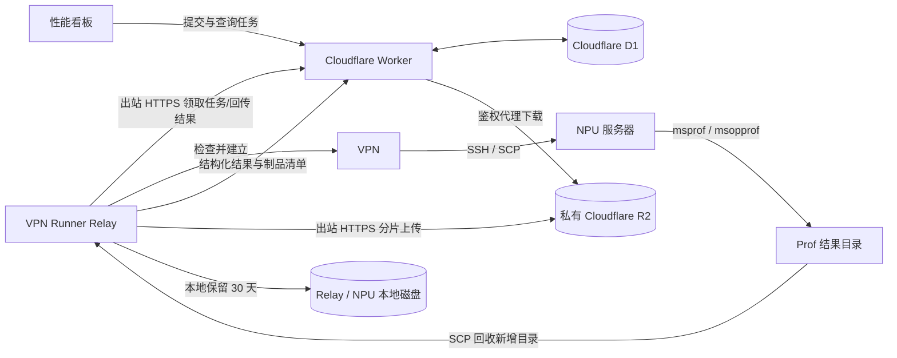
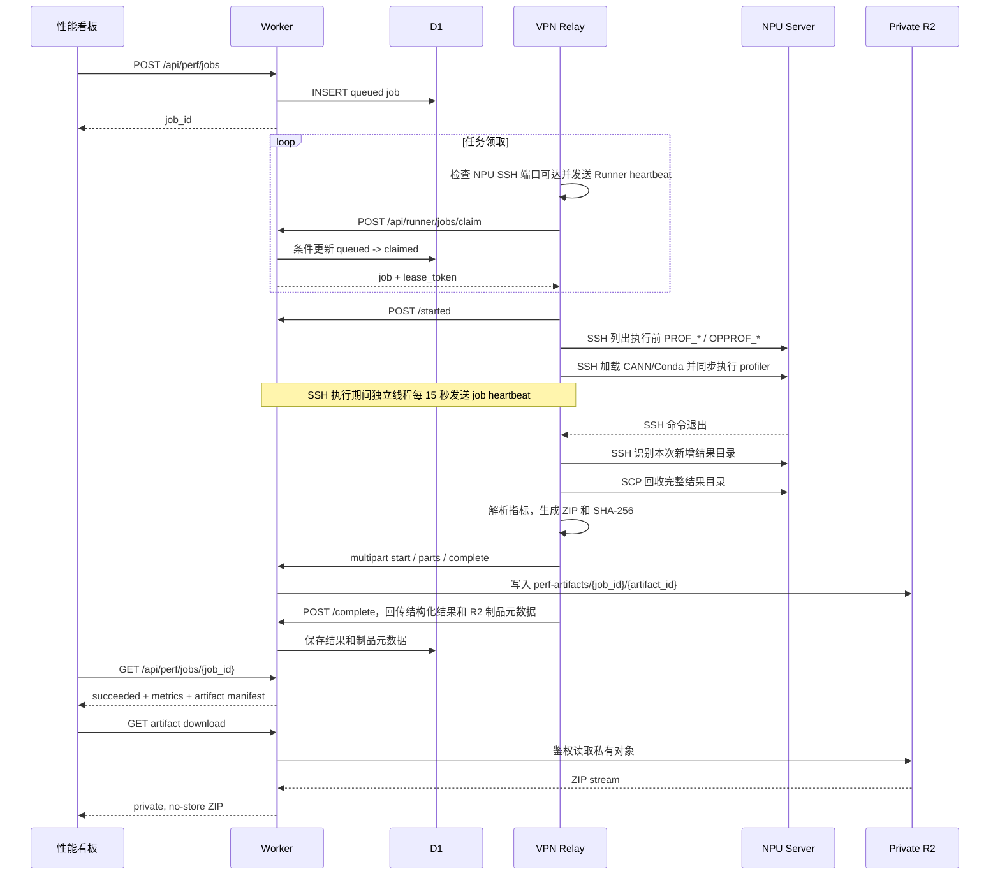
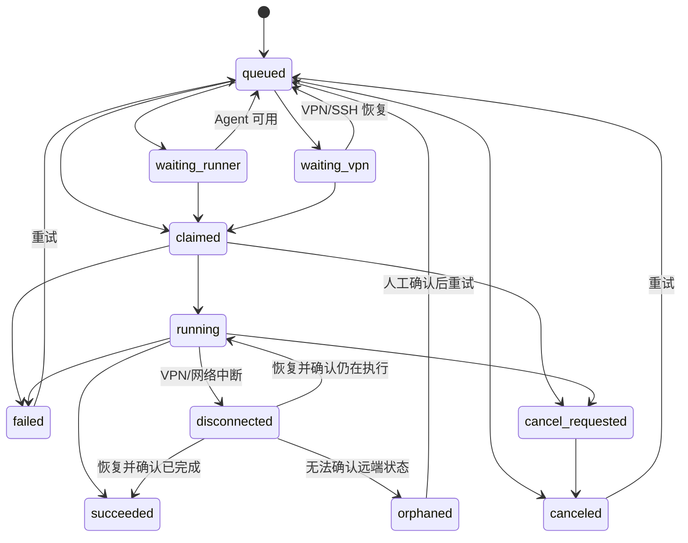
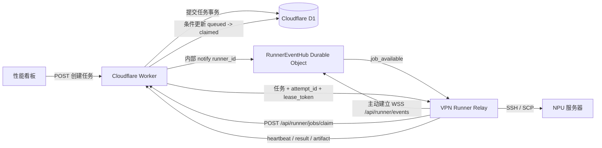
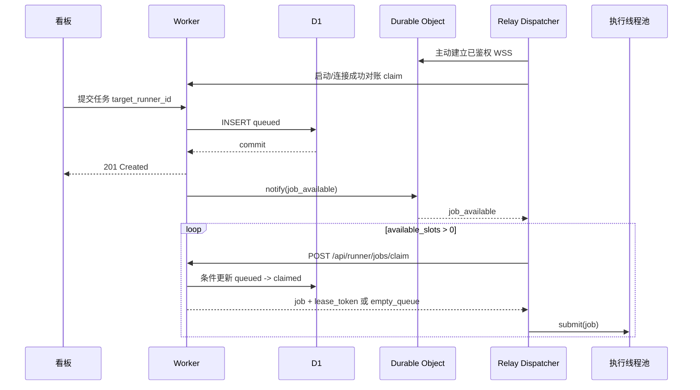

# NPU VPN 性能测试任务执行方案

## 1. 文档目的

本文设计一套从性能看板提交 `msprof` / `msopprof` 性能测试任务，并在只能通过 VPN 访问的 NPU 服务器上可靠执行、回传指标和保留 Prof 制品的方案。

推荐架构为：

> Cloudflare Worker/D1 负责任务控制面，VPN Runner Relay 负责跨越 VPN，NPU 服务器负责实际执行；Relay 保留本地副本，并将压缩制品上传到私有 Cloudflare R2。

当前部署已启用私有 R2，在线下载由 Worker 执行用户权限校验和对象代理，不公开 Bucket，也不向浏览器或 Relay 分发 R2 凭据。

本文同时记录目标架构和当前实现。build_install 已采用 NPU 服务器持久进程、状态文件和 Relay 重启恢复；profile 仍采用 Windows Relay 同步 SSH 执行。远端 Device 锁和测试任务断线恢复仍属于后续阶段。

该方案不要求 NPU 服务器暴露公网端口，也不要求 Cloudflare Worker 直接连接 SSH。

最终安全决策为：即使 Relay 具备公网可达条件，也不把 Relay 建设为公网服务。Relay 不提供 Webhook、不运行公网 HTTP API、不开放公网监听端口；任务领取、状态回传和制品上传全部由 Relay 主动发起出站连接。

### 1.1 当前实现摘要（2026-08-18）

| 层级 | 当前实现 | 关键边界 |
| --- | --- | --- |
| 用户界面 | GitHub Pages 性能看板 | 提交测试、查看 A2/A5 与 NPU 占用、管理员配置执行环境并从 NPU 仓库分支列表中选择构建分支、下载 Prof ZIP |
| 公网控制面 | Cloudflare Worker + D1 | 认证、任务队列、精确路由、租约、强制状态刷新、指标和制品元数据 |
| 对象存储 | 私有 Cloudflare R2 | 保存 ZIP；由 Worker 鉴权代理下载，Bucket 不公开 |
| VPN 边界 | 当前 Windows 电脑上的两个 Relay 计划任务 | 主动领取任务，每 30 分钟自动查询一次 NPU 状态；启动器监督 Agent，异常退出后 5 秒重启 |
| 执行面 | A2 `192.168.9.221` 与 A5 `192.168.13.241` | 测试使用同步 SSH；编译使用独立 worktree、脱离 SSH 的进程、状态文件和持久日志 |
| 本地兜底 | Relay 本地 Prof 目录，默认保留 30 天 | R2 上传失败时仍保留结构化结果和本地原始制品 |

当前链路把源码编译安装与性能测试分成两种独立任务。管理员提交 `build_install` 后，Relay 仅通过一次短 SSH 调用在 NPU 服务器启动 `setsid + nohup` 脚本；脚本在环境锁内解析 commit、创建 detached worktree，并执行一次环境检查、wheel 构建、安装和安装校验。`controls/<attempt_id>` 独立保存 PID、阶段、退出码、commit 和完整日志，`worktrees/<attempt_id>` 只保存源码，清理 worktree 不会删除执行证据。Relay 退出后由 Windows 启动器重启，Agent 从本地任务记录恢复同一远端句柄，不重复编译。

用户随后提交 profile 任务，Relay 校验所选分支与当前部署一致，再通过同步 SSH 执行服务端生成的 msprof / msopprof 命令，以 SCP 回收本次新增 Prof 目录，在内存中解析指标，生成 ZIP 和 SHA-256，经 Worker multipart API 上传私有 R2。登录用户从看板下载时，由 Worker 校验任务归属后代理返回 R2 对象。

NPU 状态链路与任务领取解耦：每个 Relay 默认每 30 分钟在后台分卡执行 `npu-smi info -t usages` 和 `npu-smi info -t proc-mem`，通过 heartbeat 把利用率、HBM 和完整进程明细写入 D1；看板每 10 秒只读取最近缓存。用户点击“刷新”时，Worker 将强制刷新请求持久化，Relay 在下一次出站 heartbeat 收到请求后立即重新采样，因此不需要向 Relay 开放入站端口。

当前已完成队列、双 Relay、A2/A5 精确路由、单 Agent 三执行线程、管理员自定义执行环境、编译任务持久执行与重启恢复、编译进程组取消、编译日志查看、NPU 占用查询与强制刷新、R2 上传、9 GB 容量保护和看板下载闭环。当前按阶段决策不实现 Device 锁，允许相同 Device 上的测试并发；profile 任务仍未实现远端持久执行，因此性能测试期间 VPN 中断仍需人工核对远端进程和 Prof 目录。

## 2. 当前条件

- 性能看板部署在 GitHub Pages，可访问 Cloudflare Worker。
- Cloudflare Worker 已连接 D1，并提供用户认证和权限控制。
- `backend/perf_runner.py` 已支持 `PERF_RUN_MODE=ssh` 和 `PERF_RUN_MODE=local`。
- `msprof` / `msopprof` 必须运行在安装了 NPU 驱动和工具链的服务器上。
- NPU 服务器只能在本机或指定网关开启 VPN 后通过 SSH 访问。
- VPN 可能断开、续期、需要 MFA，不能假设连接永久稳定。
- Profiling 原始目录可能很大，不适合直接存入 D1。
- 当前 Relay 是用户开启 VPN 的 Windows 电脑，通过两个登录触发的计划任务分别运行 A2 和 A5 Agent。
- A2 SSH 目标为 `root@192.168.9.221:22`，项目目录为 `/workspace/fazhenyao/flash-linear-attention-npu-io`；CANN 环境脚本为 `/data/fazhenyao/cann/3_23/ascend-toolkit/set_env.sh`，Conda 环境为 `fla_dump`。
- A5 SSH 目标为 `npu_user7@192.168.13.241:22`，采集输出工作目录为 `/home/npu_user7/fazhenyao/flash-linear-attention-npu-io`，执行脚本为 `/home/npu_user7/fazhenyao/flash-linear-attention-npu/examples/flash_gated_delta_rule.py`；CANN 环境脚本为 `/home/npu_user7/fazhenyao/cann/7_20/ascend-toolkit/set_env.sh`，Conda 环境为 `f30077529`。

## 3. 设计目标

1. 用户可以在公网性能看板提交采集任务并查看进度。
2. NPU 服务器无需开放公网入站端口。
3. Relay 无需开放公网入站端口，不直接承受公网扫描、暴力请求和 DDoS。
4. VPN 未连接时任务可靠排队，不丢失、不误报失败。
5. VPN 执行中断开时，远端命令尽可能继续执行并可恢复跟踪。
6. 防止同一任务或同一 NPU Device 被重复并发执行。
7. 用户不能通过任务参数执行任意 Shell 命令。
8. 结构化指标可直接在看板展示，有权限的用户可从看板下载 R2 中的原始制品。
9. 每次执行可追踪到用户、代码版本、运行环境、命令模板和制品。

## 4. 非目标

- Cloudflare Worker 不直接执行 `msprof` / `msopprof`。
- Cloudflare Worker 不直接建立 SSH 或 VPN 连接。
- GitHub Pages 不直接访问本机 `127.0.0.1` 或 NPU 服务器。
- Relay 不接收 Cloudflare Worker 或其他公网系统发起的 Webhook。
- Relay 不通过公网 HTTP API 接收采集任务。
- D1 不存储完整 Prof 目录、压缩包或超大日志。
- 用户提交的数据中不允许包含任意可执行命令。

## 5. 推荐架构



### 5.1 组件职责

#### 性能看板

- 提交结构化测试参数，选择目标 A2/A5 Relay 和 NPU 卡号。
- 展示任务状态、排队原因、执行日志摘要、结构化指标和最近一次 NPU 设备占用。
- 管理员可选择 CANN 路径、Conda 环境、源码仓库和已有分支，单独提交编译安装任务。
- 提供强制刷新 NPU 状态、取消、重试、结构化结果查看和完整 Prof ZIP 下载入口。
- 不持有 Runner 凭据和 SSH 凭据。

#### Cloudflare Worker

- 验证用户身份和提交权限。
- 校验任务类型、脚本、参数范围、幂等键和管理员自定义执行环境字段。
- 管理任务状态机、Agent 注册、能力路由、租约、事件、取消请求和 NPU 强制刷新请求。
- 为看板提供查询接口，为 Relay 提供专用接口。
- 保存结构化结果和制品元数据，并代理经过任务权限校验的私有 R2 下载。
- 不执行长时间采集命令。

#### Cloudflare D1

- 保存任务、状态、执行尝试、Agent、NPU 刷新请求、事件、结果、制品元数据和活跃上传预留。
- 作为控制面的事实来源。
- 不保存完整 stdout/stderr 和 Prof 压缩包。

#### VPN Runner Relay

- 部署在同时能访问互联网和 VPN 的机器上。
- 主动通过 HTTPS 从 Worker 领取任务，不开放公网监听端口。
- 领取前检查 NPU SSH 端口可达性；默认每 30 分钟后台分卡查询 `npu-smi`，并支持 Worker 下发的强制刷新请求；执行时由 SSH 命令加载并验证远端环境。
- 复用 `backend/perf_runner.py` 的命令构建和结果导入逻辑。
- 上报默认执行环境和 `customizable` / `source_build` 能力，确保自定义环境和构建任务只路由给兼容 Agent。
- 编译任务通过短 SSH 连接启动和轮询远端持久进程；测试任务通过同步 SSH 执行，并以 SCP 回收本次新增的结果目录。
- 发送 heartbeat、进度和日志摘要。
- 在本地保留制品，生成 ZIP 和 SHA-256，经 Worker multipart API 上传 R2，并回传结构化结果和制品元数据。

#### 当前 NPU 服务器执行方式

- Relay 进入固定项目目录并执行服务端白名单生成的命令，不接收用户提供的任意 Shell。
- 每次命令先加载目标服务器的 CANN `set_env.sh`，再加载 Conda 初始化脚本；A2 激活 `fla_dump`，A5 激活 `f30077529`。
- 管理员可以按任务选择 Relay 允许根目录内的 CANN、Conda 和源码仓库；普通用户继续使用 Relay 默认环境。
- 独立编译任务可明确选择本地分支或 `origin` 远程跟踪分支；远程分支构建会尝试刷新 `origin`，失败时回退到服务器已有的缓存引用。随后在 detached worktree 中解析准确 commit，按芯片固定 SoC 构建并安装 wheel，不切换或修改主源码工作区。成功版本通过环境专属链接保留，供后续测试使用。
- `msprof` 输出到 `data/prof_gdr`，`msopprof` 输出到 `data/prof_op`。
- 编译脚本使用 `setsid + nohup` 脱离 SSH 会话，并在 worktree 外原子写入 state、exit_code、pid、commit 和 build.log；同一 CANN、Conda、源码仓库和芯片组合使用独立 `flock` 串行构建安装。测试命令仍同步等待 SSH 会话。Device 锁和测试任务远端状态文件属于后续阶段。

#### 本地制品存储

- NPU 服务器和 Relay 保存原始 Prof 目录及其中的 CSV、JSON 和分析文件；Relay 只在上传期间生成临时 ZIP。
- 制品目录不得通过公网服务暴露，只允许管理员经 VPN/SSH 访问。
- Relay 回收副本默认保留 30 天，由 Agent 清理；当前不会自动删除 NPU 服务器上的源目录。
- D1 只记录制品路径、类型、大小、SHA-256 和过期时间。

#### Cloudflare R2

- Bucket 保持私有，不启用公共开发 URL 或自定义公开域名。
- Relay 使用 Runner Token 经 Worker multipart API 上传，不持有 R2 API Token。
- 浏览器经 Worker 鉴权代理下载，不获得直接对象地址。
- Worker 将“现有对象 + 活跃上传预留”限制在 `9,000,000,000` 字节；达到阈值时按 R2 `uploaded` 时间删除最旧的 `perf-artifacts/` 对象，并同步删除 D1 制品记录。

### 5.2 网络与攻击面

```text
性能看板  --公网 HTTPS--> Cloudflare Worker / D1
Relay     --公网 HTTPS--> Cloudflare Worker
Relay     --VPN 内 SSH--> NPU 服务器

互联网    --禁止-------> Relay
互联网    --禁止-------> NPU 服务器
Worker    --不连接-----> Relay
```

Relay 主机防火墙默认拒绝所有公网入站连接。Relay 不配置公网域名，不运行 Cloudflare Tunnel，也不部署 Webhook 服务。公网扫描和 DDoS 攻击面集中在 Cloudflare Worker；即使 Worker 暂时不可用，影响也应限制为任务延迟，不能形成进入 Relay 或 VPN 内网的连接路径。

Relay 只允许以下必要出站流量：

- 到 Worker API 的 HTTPS 443，用于领取任务、heartbeat 和回传结果。
- 通过 VPN 到 NPU 服务器的 SSH 22，用于执行和回收结果。

可在 Relay 上进一步设置出站白名单、DNS 限制和响应体大小限制，减少 Worker 凭据泄露或异常响应造成的风险。

## 6. 部署拓扑选择

### 6.1 推荐：专用 VPN Relay

在一台长期在线的专用机器上安装 VPN 客户端和 Relay：

```text
互联网访问：允许访问 Worker 的 HTTPS 443
VPN 访问：允许连接内部网络
NPU 访问：VPN 建立后允许 SSH 22
运行方式：Linux systemd、Windows Service 或 Windows 计划任务
```

优点是任务不依赖个人电脑是否在线，VPN 凭据和 SSH 密钥也可以集中治理。

专用 Relay 即使拥有公网 IP，也应关闭所有非必要入站服务。运维登录应通过受控管理网络或 VPN 进行，不应为了接收任务开放公网 HTTP 端口。

### 6.2 过渡方案：个人电脑 Relay

如果当前 VPN 只能在个人电脑上运行，可先在该电脑启动 Relay：

- 电脑或 VPN 离线时，任务保留在 D1 中等待。
- Relay 上线后自动消费队列。
- 看板显示“等待 VPN 执行器上线”。
- 不应把它作为无人值守生产方案。

### 6.3 可选：NPU 服务器直接运行 Agent

如果 NPU 服务器能够主动访问互联网，可直接在 NPU 服务器运行 Agent，省略 SSH 和 Relay。Agent 仍然主动连接 Worker，不开放公网端口。

如果 NPU 服务器无法访问互联网，则继续使用 VPN Relay。

## 7. 任务执行流程



### 7.1 通知领取与自适应轮询回退

当前 A2/A5 Relay 均已启用 WebSocket 通知，收到 `job_available` 后立即领取，并每 5 分钟执行一次故障对账。关闭通知开关或缺少 WebSocket 依赖时，仍使用线性自适应轮询回退，配置为 `RUNNER_POLL_MIN_SECONDS=2`、`RUNNER_POLL_MAX_SECONDS=30`：

```text
Relay 启动：注册后立即执行一次 heartbeat、健康检查和领取，不先等待
连续未领取到任务：等待时间按 4、6、8……30 秒递增
VPN 或 SSH 不可用：本轮不领取，沿用相同线性退避，最大 30 秒
成功领取并完成任务：下一轮等待重置为 2 秒
任务执行中：Dispatcher 在活动任务少于 `RUNNER_MAX_CONCURRENCY` 时继续领取；每个任务由通用执行线程处理并独立发送 job heartbeat
Worker 请求异常：至少等待 5 秒并指数退避，最大 120 秒
NPU 状态：独立后台线程最多每 30 分钟发起一次自动查询，完成后立即补发 Runner heartbeat
看板状态：登录后每 10 秒读取一次 Worker 中的最新状态，不触发 NPU 命令
```

WebSocket 重连已使用随机抖动；轮询回退路径仍没有随机抖动，也没有采用 Worker 返回的 `retry_after_seconds`。部署更多 Relay 时，应为回退轮询增加抖动并尊重服务端建议间隔，避免同时集中请求。

领取接口只返回 Relay 能力范围内的任务，并限制响应数量和响应体大小。没有可执行任务时返回正常空结果，不把空队列作为错误。

### 7.2 多 Relay 精确路由

看板从 Worker 的 Runner 状态接口读取在线 Agent，并在“执行服务器”下拉框中显示 Runner 名称、芯片、默认 NPU 卡号和在线状态。选择服务器后，“NPU 设备占用”表展示该 Agent 最近上报的每张卡状态、NPU/AI Core/AI Vector 利用率、HBM 使用量和进程数，并每 10 秒自动读取最新 heartbeat。点击进程数可展开完整 PID、进程名和显存明细，详情区域限制在组件宽度内，字段过长时允许横向滚动。

刷新按钮执行强制重新采样，而不是只读取缓存：浏览器向 Worker 创建带唯一 ID 的刷新请求，Worker 将请求持久化在 `runner_agents`；Relay 在下一次出站 heartbeat 响应中收到请求后，立即启动新一轮 `npu-smi`，再将同一 ID 随结果上报。Worker 确认该 ID 后清除待处理请求，看板轮询到对应 ID 才结束“正在重新采样”状态，最多等待 120 秒。请求在 Relay 暂时离线时不会丢失，整个过程仍不建立到 Relay 或 NPU 的入站连接；180 秒内的并发请求复用同一个待处理 ID，避免重复采样和相互覆盖。提交任务时同时发送：

- `target_runner_id`：指定本次任务必须由哪个 Agent 领取。
- `chip`、`device` 和 `prof_tool`：继续作为能力匹配和执行参数。

Worker 领取任务时先校验 `target_runner_id`，再校验 Agent 上报的芯片、卡号和 profiler 能力。未被指定的 Agent 即使芯片相同也不能领取该任务；目标 Agent 离线时，任务保留在 D1 等待，不会自动漂移到其他服务器。

当前两个 Agent 共享同一个 Runner Token，但使用不同的 `RUNNER_ID`、配置文件、状态目录、日志、计划任务和本地制品目录。后续应为每个 Agent 签发可单独吊销和轮换的凭据。

任务提交仍只接受 Worker 白名单中的 `script_id`。`PERF_REMOTE_SCRIPT` 是受信任的 Relay 本机配置，用于把该白名单 ID 映射到特定 NPU 主机上的脚本路径；浏览器用户不能提交或覆盖远端路径。

### 7.3 管理员自定义执行环境与独立编译安装

选择 Relay 后，看板从该 Relay 的 capabilities 读取默认 CANN 路径、Conda 环境、源码仓库和构建能力。普通用户只能使用这些默认值；管理员进入界面后，看板通过 Worker 在 D1 写入带 Runner 和源码路径的分支查询请求。Relay 在下一次出站 heartbeat 收到请求后，先通过 SSH 读取目标仓库现有的 `refs/heads/*` 与 `refs/remotes/origin/*`，再用 8 秒远端超时尝试执行 `git fetch --prune origin` 并重新读取；fetch 失败时仍返回第一次读取的引用。成功列表会原子写入 Relay 本地状态目录，后续 SSH 查询失败或 Relay 重启时继续作为缓存上报。Relay 再把带来源的分支列表和同一请求 ID 随 heartbeat 回传。看板轮询到匹配结果后按“本地分支”和“远程分支（origin）”分组填充下拉框；刷新失败但存在缓存时保留下拉框并显示缓存提示，因此不需要向 Relay 增加入站接口，也不会在前端写死分支。

| 字段 | 含义 | 约束 |
| --- | --- | --- |
| `cann_path` | Ascend Toolkit 根目录或其 `set_env.sh` | 必须为 POSIX 绝对路径，并位于 Relay 配置的 `PERF_ALLOWED_CANN_ROOTS` 内 |
| `conda_env` | Conda 环境名称 | 只允许字母、数字、点、下划线和连字符 |
| `source_repo` | `flash-linear-attention-npu` 源码仓库 | 必须为 POSIX 绝对路径，并位于 `PERF_ALLOWED_SOURCE_ROOTS` 内 |
| `rebuild` | 是否执行构建 | `build_install` 固定为 `true`；新 `profile` 任务固定为 `false`；旧的组合任务仍兼容 |
| `branch` | 从 Relay 返回的源码分支中选择 | 编译任务必须提交；测试任务提交时表示必须使用该环境中已部署的同名分支版本；服务端仍拒绝危险 Git ref 形式 |
| `branch_source` | 分支来源 | 仅允许 `local` 或 `remote`；`remote` 固定对应 `origin`，用户不能指定任意 Git remote 或 URL |

Worker 先执行角色、任务类型、字段白名单、路径格式和分支格式校验；`build_install` 只允许管理员提交，必须指定目标 Relay，并要求 Relay 显式上报 `job_types`、`source_build` 和 `source_deployment` 能力。Relay 再执行允许根目录校验、远端文件检查和已部署版本匹配，形成控制面与执行面双重约束。

独立编译与测试流程固定为：

1. 看板下拉框列出目标仓库的 `refs/heads/<branch>` 和已缓存的 `refs/remotes/origin/<branch>`，并明确携带 `branch_source`；Relay 执行时再次使用 `git check-ref-format` 校验分支。选择远程分支时会用 30 秒远端超时尝试 `git fetch --prune origin` 更新引用，网络不可用时继续使用查询时已经存在的缓存 commit。
2. 短 SSH 只写入并启动远端脚本；脚本获取当前环境的 `locks/<environment_id>.lock` 后，把分支解析为准确 commit，在 `worktrees/<attempt_id>` 创建唯一 detached worktree，不切换主源码仓库当前分支。
3. 在管理员选择的 CANN/Conda 环境中只执行一次源码仓库 README 对应流程：`python scripts/check_npu_env.py --build-only`、构建 wheel、精确安装本次生成的 wheel，再使用 `pip show` 校验安装结果。
4. 构建目标由 Relay 芯片固定映射，用户不能覆盖：A2 为 `ascend910b`、A3 为 `ascend910_93`、A5 为 `ascend950`。
5. 构建成功后先写入包含 branch、commit、SoC、attempt_id 和环境部署标识的 marker，再通过临时链接和 `mv -T` 原子更新 `active/<environment_id>`；激活后再次校验链接目标和 marker。
6. Worker 确认成功结果已持久化后，Relay 写入 acknowledged 标记，并只清理同一环境更旧的成功 worktree；当前版本保留当前版本及前两个成功版本，以便核对和回退。控制目录和日志不随 worktree 清理。
7. 后续测试选择分支时，Relay 必须确认部署标记中的分支和 SoC 匹配，再从已激活 worktree 执行 manifest 中所选示例的相对路径；不匹配则要求先执行编译安装。

当前 A5 主机不能稳定访问 GitHub，因此要在 A5 上编译的远程分支应预先存在于 `refs/remotes/origin/*` 缓存中，或者直接使用本地分支。本地分支不会触发网络 fetch；远程分支即使刷新失败也可使用已有缓存。任务记录保存实际 CANN、Conda、源码仓库、分支来源、分支、commit 和 SoC。编译任务记录显示“编译安装”及结果，不展示构建 Shell；测试任务的命令字段仍只展示对应的 `msprof` 或 `msopprof` profiler 命令。

### 7.4 多测试示例与动态参数

测试示例采用显式 manifest 管理，不通过运行脚本或解析 `--help` 自动发现参数。当前权威清单位于 IO 仓库的 `docs/perf-examples.json`，由 GitHub Pages 与 Relay 共同读取；后续 `flash-linear-attention-npu` 分支提供 `examples/dashboard_examples.json` 时，Relay 可按已激活部署的 commit 读取并校验该清单。manifest 为每个示例保存稳定 ID、展示名称、源码相对路径、模型类型及参数 schema。

首批接入四个示例：

| 示例 ID | 脚本 | 参数类别 |
| --- | --- | --- |
| `flash_gated_delta_rule` | `examples/flash_gated_delta_rule.py` | 长序列形状、varlen、DemoModel |
| `flash_kda` | `examples/flash_kda.py` | 长序列形状、状态、safe gate、重计算、短卷积、DemoModel |
| `recurrent_gated_delta_rule` | `examples/recurrent_gated_delta_rule.py` | decode/MTP 形状、卷积缓存、Delta state、accepted tokens |
| `recurrent_kda_layer` | `examples/recurrent_kda_layer.py` | decode/MTP 形状、短卷积、KDA state、safe gate、accepted tokens |

看板从所选 Relay 的 capabilities 读取 `test_examples`，选择示例后按 schema 动态生成分组表单；布尔值使用复选框，枚举使用下拉框，数值使用带范围的输入框，整数列表使用逗号分隔的结构化输入。`visible_when` 控制 varlen、safe gate 和短卷积从属字段。设备、profiler、CANN、Conda 和源码分支仍为示例外的通用执行设置。

任务只提交 `example_id`、`example_schema_version` 和结构化 `attributes`。Worker 执行示例 ID、属性名称、类型、长度和总请求大小的控制面校验；Relay 从本地 manifest 重新解析示例，执行精确范围、枚举、条件和跨字段约束校验，再使用 `shlex` 生成参数。浏览器不能提交脚本绝对路径、Shell 或未登记 CLI 参数。旧任务中的 `scripts/flash_gated_delta_rule.py` 继续映射到 `flash_gated_delta_rule`。

跨字段约束由 Relay 最终执行：Flash KDA 要求 query heads 等于 value heads，varlen 要求 batch 为 1；两个 recurrent 示例要求 value heads 可被 query heads 整除，MTP 范围为 1 至 8，启用短卷积且 MTP 大于 1 时 conv kernel 必须为 4；Recurrent KDA 固定 key dim 为 128。任务与结果保存示例 ID 和完整结构化属性，recurrent 用例保留 `mtp`，不伪装成长序列 `tokens`。

当前实现落点如下：

- `docs/perf-examples.json`：四个示例及其参数 schema，供 GitHub Pages 表单和 Relay 使用。
- `docs/performance-dashboard.html`：按 Runner 能力过滤示例，动态生成参数表单，并为每个示例分别保留尚未提交的输入值。
- `cloudflare/worker.js`：接受 `example_id`，拒绝未登记示例和属性，并按 `test_examples` 将任务路由到兼容 Runner。
- `backend/perf_examples.py`、`backend/perf_runner.py`：执行最终类型、范围及跨字段校验，解析目标脚本并生成受控 profiler 命令。
- `scripts/import_prof_gdr.py`、`scripts/import_msprof_op.py`：将示例 ID 和原始参数写入用例、快照及执行结果，训练与 recurrent 示例使用各自的标签格式。

部署要求：Pages、Worker 和 Relay 应使用同一版本的 schema。新示例上线时先部署 Worker 和 Relay，再发布 Pages；目标源码分支必须实际包含对应脚本。当前 schema 版本为 `1`，Worker 接受并保存版本号，Relay 始终以本机清单进行最终校验。

## 8. 任务状态机



### 8.1 断线语义

- 领取前 VPN 不可用：不领取任务，记录 `waiting_vpn`。
- 领取后尚未远端启动：安全释放任务并重新排队。
- 编译远端启动后 VPN 断开：构建进程继续运行，Worker 可暂时标记 disconnected；Relay 保留同一 attempt_id 和远端句柄，连接恢复后继续轮询。
- 测试远端启动后 VPN 断开：当前同步 SSH 实现通常会因 SSH 失败而结束本次尝试，仍需人工核对。
- Relay 重启后先扫描本地活跃编译记录；`claimed` / `running` 记录必须先通过 Worker heartbeat 确认 attempt 和租约仍有效，Worker 已终态或握手失败时绝不启动远端命令。确认有效后才继续查询远端状态；`reporting` / `reporting_failure` / `reporting_orphaned` 只重发已持久化的原结果，不重新执行编译。
- 控制目录缺失时，Relay 会核对 active marker 的 attempt_id；匹配则恢复为成功，不匹配或也缺失才进入 `orphaned`。
- `orphaned` 禁止自动重跑；只有管理员核对并在看板明确确认旧进程已停止后，Worker 才接受重试，并记录确认人、旧状态和旧 attempt_id。

不能简单地在 heartbeat 超时后重新排队，因为原任务可能仍在 NPU 上运行，重新执行会产生重复任务和 Device 冲突。当前版本在执行期断线后应由管理员确认远端进程和 Prof 目录，再决定是否重试。

## 9. API 设计

### 9.1 用户接口

```text
POST /api/perf/jobs
GET  /api/perf/jobs
GET  /api/perf/jobs/{job_id}
GET  /api/perf/jobs/{job_id}/events
POST /api/perf/jobs/{job_id}/cancel
POST /api/perf/jobs/{job_id}/retry
GET  /api/perf/jobs/{job_id}/artifacts
GET  /api/perf/jobs/{job_id}/artifacts/{artifact_id}/download
GET  /api/perf/runner
POST /api/perf/runner/npu-status/refresh
POST /api/perf/runner/source-branches/refresh       # 管理员
GET  /api/perf/artifacts/storage                 # 管理员
```

### 9.2 Runner 接口

```text
POST /api/runner/register
POST /api/runner/heartbeat
POST /api/runner/jobs/claim
POST /api/runner/jobs/{job_id}/started
POST /api/runner/jobs/{job_id}/heartbeat
POST /api/runner/jobs/{job_id}/events
POST /api/runner/jobs/{job_id}/artifacts
POST /api/runner/jobs/{job_id}/artifacts/multipart/start
PUT  /api/runner/jobs/{job_id}/artifacts/multipart/{artifact_id}/parts/{part_number}
POST /api/runner/jobs/{job_id}/artifacts/multipart/{artifact_id}/complete
POST /api/runner/jobs/{job_id}/artifacts/multipart/{artifact_id}/abort
POST /api/runner/jobs/{job_id}/complete
POST /api/runner/jobs/{job_id}/fail
POST /api/runner/jobs/{job_id}/reconcile
```

Runner 接口使用独立的服务凭据，不能复用浏览器用户 Token。

当前已增加 R2 multipart 上传和 Worker 鉴权下载接口；R2 上传失败时仍登记 Relay 本地制品清单并保留结构化结果。

### 9.3 用户提交示例

```json
{
  "prof_tool": "msopprof",
  "script_id": "scripts/flash_gated_delta_rule.py",
  "case_id": "case-kda-h96",
  "target_runner_id": "vpn-runner-windows-a5-01",
  "chip": "A5",
  "device": 7,
  "kernel_name": "kda_forward",
  "parameters": {
    "batch": 1,
    "tokens": 4096,
    "query_heads": 32,
    "value_heads": 32,
    "key_dim": 128,
    "value_dim": 128,
    "chunk_size": 64,
    "dtype": "bf16"
  },
  "execution_environment": {
    "cann_path": "/home/npu_user7/fazhenyao/cann/7_20/ascend-toolkit",
    "conda_env": "f30077529",
    "source_repo": "/home/npu_user7/fazhenyao/flash-linear-attention-npu",
    "rebuild": true,
    "branch": "8_7",
    "branch_source": "remote"
  },
  "idempotency_key": "4eae9183-c018-4d5e-a455-d5c5bc393043"
}
```

`execution_environment` 为管理员专用字段；普通用户提交该字段会得到 `403`。Worker 将页面参数转换为规范化任务，不允许提交 `command`、Shell 片段、任意脚本路径、构建命令或 SoC 参数。

### 9.4 完成结果示例

```json
{
  "attempt_id": "attempt-9e2f",
  "lease_token": "runner-issued-lease-token",
  "exit_code": 0,
  "started_at": "2026-08-08T10:00:00+08:00",
  "finished_at": "2026-08-08T10:08:32+08:00",
  "environment": {
    "agent_version": "1.6.1",
    "runner_id": "vpn-runner-windows-a5-01",
    "mode": "ssh",
    "chip": "A5",
    "device": 7,
    "soc_version": "Ascend950PR",
    "cann_path": "/home/npu_user7/fazhenyao/cann/7_20/ascend-toolkit",
    "conda_env": "f30077529",
    "source_repo": "/home/npu_user7/fazhenyao/flash-linear-attention-npu",
    "rebuild": true,
    "branch": "8_7",
    "branch_source": "remote",
    "commit": "50d5038314f3514c1e32e628ade185ff736d7be1",
    "soc": "ascend950"
  },
  "metrics": {
    "duration_us": 131.24,
    "mfu": 0.61,
    "mbu": 0.73
  },
  "artifacts": [
    {
      "artifact_type": "prof_archive",
      "object_key": "r2://perf-artifacts/job-123/artifact-abc",
      "filename": "PROF_000001.zip",
      "content_type": "application/zip",
      "size_bytes": 104857600,
      "sha256": "..."
    }
  ]
}
```

## 10. D1 数据模型

### 10.1 perf_jobs

```sql
CREATE TABLE perf_jobs (
  id TEXT PRIMARY KEY,
  created_by TEXT NOT NULL,
  idempotency_key TEXT NOT NULL,
  tool TEXT NOT NULL,
  script_id TEXT NOT NULL,
  request_json TEXT NOT NULL,
  status TEXT NOT NULL,
  status_message TEXT NOT NULL DEFAULT '',
  runner_id TEXT,
  attempt_id TEXT,
  lease_token_hash TEXT,
  lease_expires_at TEXT,
  remote_execution_id TEXT,
  cancel_requested INTEGER NOT NULL DEFAULT 0,
  exit_code INTEGER,
  created_at TEXT NOT NULL,
  claimed_at TEXT,
  started_at TEXT,
  finished_at TEXT,
  updated_at TEXT NOT NULL,
  UNIQUE(created_by, idempotency_key)
);
```

### 10.2 perf_job_events

保存状态变化、有限长度日志和诊断信息。完整日志保存在 NPU 服务器或 Relay 本地磁盘。

```sql
CREATE TABLE perf_job_events (
  id INTEGER PRIMARY KEY AUTOINCREMENT,
  job_id TEXT NOT NULL,
  attempt_id TEXT,
  event_type TEXT NOT NULL,
  level TEXT NOT NULL DEFAULT 'info',
  message TEXT NOT NULL,
  detail TEXT NOT NULL DEFAULT '{}',
  created_at TEXT NOT NULL
);
```

### 10.3 perf_results

保存看板需要查询和比较的结构化指标。

```sql
CREATE TABLE perf_results (
  id TEXT PRIMARY KEY,
  job_id TEXT NOT NULL UNIQUE,
  case_id TEXT,
  model_id TEXT,
  snapshot_id TEXT,
  environment_json TEXT NOT NULL DEFAULT '{}',
  metrics_json TEXT NOT NULL DEFAULT '{}',
  result_json TEXT NOT NULL DEFAULT '{}',
  created_at TEXT NOT NULL
);
```

### 10.4 perf_artifacts

```sql
CREATE TABLE perf_artifacts (
  id TEXT PRIMARY KEY,
  job_id TEXT NOT NULL,
  artifact_type TEXT NOT NULL,
  object_key TEXT NOT NULL,
  filename TEXT NOT NULL,
  content_type TEXT NOT NULL,
  size_bytes INTEGER NOT NULL,
  sha256 TEXT NOT NULL,
  created_at TEXT NOT NULL
);
```

### 10.5 runner_agents

```sql
CREATE TABLE runner_agents (
  id TEXT PRIMARY KEY,
  name TEXT NOT NULL,
  active INTEGER NOT NULL DEFAULT 1,
  capabilities_json TEXT NOT NULL DEFAULT '{}',
  vpn_connected INTEGER NOT NULL DEFAULT 0,
  npu_reachable INTEGER NOT NULL DEFAULT 0,
  npu_status_refresh_id TEXT,
  npu_status_refresh_requested_at TEXT,
  source_branches_refresh_id TEXT,
  source_branches_requested_at TEXT,
  source_branches_repo TEXT,
  last_heartbeat_at TEXT,
  updated_at TEXT NOT NULL
);
```

## 11. 原子领取和租约

多个 Relay 可能同时看到同一个排队任务。领取必须使用带状态条件的更新：

```sql
UPDATE perf_jobs
SET status = 'claimed',
    runner_id = ?,
    attempt_id = ?,
    lease_token_hash = ?,
    lease_expires_at = ?,
    claimed_at = ?,
    updated_at = ?
WHERE id = ?
  AND status = 'queued'
  AND cancel_requested = 0;
```

只有更新行数为 1 的 Relay 获得任务。后续 Runner 请求必须同时携带 `job_id`、`attempt_id` 和 `lease_token`。

租约用于防止失联 Agent 永久占用任务，但不能在远端命令启动后直接触发自动重跑。Worker 需要根据 `remote_execution_id` 进入恢复或人工确认流程。

## 12. VPN 和 SSH 健康检查

当前 Relay 领取任务前执行以下检查：

1. 向 Worker 发送 Runner heartbeat，确认控制面 HTTPS 可用。
2. 加载本地 Relay 配置并确认执行模式为 SSH。
3. 使用 5 秒 TCP 超时探测目标 NPU 主机的 SSH 端口；不可达时不领取任务。
4. 独立后台线程通过同一 SSH 配置分卡执行 `npu-smi info -t usages -i <id>` 和 `npu-smi info -t proc-mem -i <id>`，默认查询 0 至 7 号卡。
5. 单条 `npu-smi` 使用远端 4 秒超时，整轮 SSH 查询使用 60 秒超时；单卡查询失败只将该卡标为“不可用”，不丢弃其他卡结果。
6. 领取后执行真正的 profiling SSH 命令；SSH/SCP 使用 `BatchMode=yes`、`ConnectTimeout=10`、`ServerAliveInterval=15` 和 `ServerAliveCountMax=4`。

设备状态查询与任务领取解耦：自动查询在线程中执行并使用 30 分钟缓存，强制请求绕过缓存并在当前查询结束后再启动一轮，完成后随 Runner heartbeat 写入 D1，因此不会阻塞队列轮询。占用判定为“存在设备进程，或 NPU/AI Core/AI Vector 任一利用率大于 0”；HBM 本身存在驱动基线占用，不单独作为忙碌判据。每张卡上报 `npu-smi` 返回的全部进程明细，同时保留进程数和进程内存总量；Worker 的 capabilities JSON 上限调整为 200 KB。

当前设备状态用于提交前观察，不是服务器端 Device 锁，也不阻止用户向已占用卡提交任务。端口探测和 `npu-smi` 仍不能完整证明 CANN、Conda、profiler、磁盘空间或目标脚本正常；这些检查和原子 Device 锁仍需在领取前预检与执行层补齐。

Relay heartbeat 应上报：

- VPN 是否连接。
- NPU 主机是否可达。
- 可用芯片、Device 和 profiler。
- 每张 NPU 的可用性、利用率、HBM、进程摘要及状态采样时间。
- 当前运行任务数。
- Agent 版本和最近错误。

## 13. 阶段二：远端持久执行

本节是后续可靠性设计，当前版本尚未实现。当前 Relay 通过同步 SSH 会话执行 profiler，SSH 会话结束后再识别并回收新增结果目录。

每个任务创建固定目录：

```text
/var/lib/fla-runner/jobs/{job_id}/
  request.json
  command.json
  status.json
  result.json
  stdout.log
  stderr.log
  artifacts/
```

推荐使用：

```bash
systemd-run \
  --unit=fla-job-{job_id} \
  --working-directory=/var/lib/fla-runner/jobs/{job_id} \
  /opt/fla-runner/run-job {job_id}
```

远端执行器应原子更新 `status.json`，至少包含：

```json
{
  "job_id": "job-123",
  "state": "running",
  "pid": 12345,
  "device": 2,
  "started_at": "2026-08-08T10:00:00+08:00",
  "finished_at": null,
  "exit_code": null
}
```

Relay 重启或 VPN 恢复后，应先读取该文件和 systemd unit 状态，再决定继续跟踪、回收结果或标记异常。

## 14. Device 并发控制

当前 A2/A5 Agent 均配置 `max_concurrency=3`，执行线程不绑定固定 Device，任务继续使用请求中的 `device`。按当前阶段决策不实现 Device 锁，也不因 `npu-smi` 显示占用而拒绝任务，因此同一个 Device 可以同时执行多个测试。需要明确接受性能竞争、显存不足和 profiler 失败的风险。Device 锁保留为后续可选能力；如后续启用，应满足：

- 一个 Device 默认只运行一个采集任务。
- 锁应在 NPU 服务器端实现，不能只依赖 Relay 内存。
- 锁文件包含 `job_id`、PID、创建时间和 Agent。
- 发现旧锁时必须检查 PID/systemd unit，不能直接删除。
- 多 Agent 环境下，远端 Device 锁是最后一道互斥保证。
- 任务可根据 `chip`、`device`、`prof_tool` 和脚本能力匹配 Agent。

## 15. 命令安全

用户只提交结构化参数，命令必须由服务端白名单模板生成。

必须满足：

- `tool` 只能是允许的 `msprof`、`msprof_op`、`msprof_op_sim`。
- `script_id` 必须来自固定脚本清单。
- 数值参数有类型、上下限和组合校验。
- 普通用户不能指定文件路径；管理员只能指定 Relay 允许根目录内的 CANN 和源码绝对路径。
- 自定义执行环境只包含 `cann_path`、`conda_env`、`source_repo`、`rebuild`、`branch` 和 `branch_source`，不能提交命令、环境变量、工作目录或可执行文件。
- 带自定义环境的任务只允许支持该能力的新版 Relay 领取；旧 Agent 不会领取并忽略这些字段。
- 源码分支必须通过 Git ref 格式校验；Relay 将本地与远程来源分开解析。远程来源固定为 `origin`，会尝试 fetch 后解析准确 commit，fetch 失败则使用已有远程跟踪引用，再通过唯一临时 worktree 构建。这使不能直接访问 GitHub 的 NPU 服务器仍可构建已经缓存的远程分支。
- 构建 SoC 由 Relay 芯片固定映射：A2=`ascend910b`、A3=`ascend910_93`、A5=`ascend950`，任务参数不能覆盖。
- 构建命令固定为 `check_npu_env.py --build-only`、`pip wheel --no-build-isolation --no-deps` 和精确 wheel 的 `pip install --force-reinstall --no-cache-dir --no-deps`。
- kernel 名称按允许字符集和已知算子校验。
- 本地子进程使用参数数组，避免 `shell=True`。
- SSH 远端命令中的固定参数必须正确引用。
- 远端使用低权限服务账号，不使用 root 日常执行。
- SSH 使用密钥、`BatchMode=yes` 和固定 `known_hosts`。
- Runner Token、SSH 私钥和 VPN 凭据不得进入日志或浏览器。

当前部署使用 SSH 密钥、`BatchMode=yes` 和 `StrictHostKeyChecking=accept-new`，但远端账号仍为 `root`。生产化前应创建低权限专用账号、预置并固定 `known_hosts`，同时限制该账号可访问的项目目录和可执行命令。

## 16. 日志和进度

当前空闲且执行环境可用时，`/claim` 同时完成 Runner 注册和 heartbeat，不再在领取前重复发送一次 heartbeat；执行环境不可用时仍单独 heartbeat 上报故障。执行任务时，独立线程每 15 秒发送 job heartbeat。编译任务上报远端真实阶段：`starting`、`waiting_lock`、`preparing`、`checking`、`building`、`installing`、`validating` 和 `activating`，SSH 不可达时上报 disconnected 并保留最后阶段。profile 尚未实现以下细粒度阶段事件：

```text
checking_vpn
checking_npu
preparing_remote_dir
starting_profiler
profiling
parsing
compressing
downloading
retaining_artifacts
finalizing
```

D1 中每个任务只保留有限数量、有限长度的事件。当前实现不按任务单独持久化完整 stdout/stderr；Agent 运行日志保存在 Relay 本机受限日志文件中。看板显示日志尾部，不持续把大日志写入 D1。

## 17. 结果与制品管理

### D1 保存

- 执行状态和时间。
- 退出码和失败类型。
- MFU、MBU、耗时等结构化指标。
- Agent 版本、执行模式、芯片、SoC 和 Device。
- 自定义源码构建会记录分支、准确 commit、CANN 路径、Conda 环境和构建 SoC；profiler 与驱动版本仍属于后续可追溯性增强。
- 本地制品标识、受控路径、大小、SHA-256 和过期时间。

### NPU 服务器或 Relay 本地保存

- 完整的 `PROF_*` / `OPPROF_*` 目录，当前不压缩。
- Prof 目录内由 CANN 生成的原始 CSV、JSON 和分析文件。
- Relay 任务状态与制品清单保存在 `data/runner-state`，Agent 运行日志保存在 `.local-secrets/runner.log`。
- 当前没有为每个任务单独持久化完整 SSH stdout/stderr，也没有自动生成可视化图片。Relay 会生成可复现 ZIP 用于 R2 上传，并在上传完成或失败后删除本地临时 ZIP，继续保留原始 Prof 目录。

### 当前制品处理

- profiler 在 NPU 服务器生成目录后，Relay 通过 SCP 回收完整目录。
- Relay 使用导入器在内存中生成结构化结果，并回传 Worker/D1；Relay 模式不会改写仓库中的 `data/performance-data.json` 和 `docs/performance-data.json`。
- Relay 计算整个目录的总大小和 SHA-256，在本机生成 ZIP，并以 32 MiB 分片通过 Worker 上传到私有 R2 Bucket。
- Worker 使用 R2 multipart API 写入对象；完成后在 D1 登记 `r2://perf-artifacts/{job_id}/{artifact_id}`、ZIP 大小、SHA-256 和过期时间。
- R2 上传失败不覆盖结构化结果：任务仍可完成，D1 登记 `relay://{runner_id}/{job_id}/{directory}`，看板显示“仅 Relay 本地”。
- 用户下载时由 Worker 校验登录会话和任务归属，再代理读取私有 R2 对象；Bucket 不开放 `r2.dev` 公网访问，不向浏览器或 Relay 分发 R2 API 凭据。
- 制品默认保留 30 天，由 Agent 在后续轮询中清理过期目录。
- 本地目录 `data/prof_gdr` 和 `data/prof_op` 已加入 Git 忽略列表。

### 后续带宽优化

- 在 NPU 服务器上先解析和压缩。
- 优先回传结构化摘要，不通过公网传输大文件。
- 支持按制品类型选择是否保留原始 Prof。
- 配置单任务最大本地占用量和 30 天清理策略。
- 使用 SHA-256 校验 SCP 回收结果和本地文件完整性。

## 18. 取消和重试

### 取消

1. 用户请求取消，Worker 设置 `cancel_requested=1`。
2. Relay heartbeat 收到取消状态并在本地设置取消标记。
3. 当前同步 SSH 执行不能据此终止远端 profiler；命令返回后 Relay 才回传取消结果。
4. 阶段二需通过远端持久执行器终止进程组或 systemd unit，并在确认结束后回传 `canceled`。

VPN 断开时取消请求保持待处理，不能声称已经取消。当前版本的取消不具备进程级实时性，这是已知限制。

### 重试

- 领取前失败可以自动重试。
- SSH 启动前失败可以安全重新排队。
- 远端启动后的普通失败可在保留日志的前提下重试；远端状态无法确认时进入 `orphaned`。
- `orphaned` 仅允许管理员在看板确认远端进程已经停止后重试，Worker 保存该确认审计；普通用户和未携带确认的请求均被拒绝。
- 每次重试生成新的 `attempt_id`，但保留原 `job_id`。
- 限制最大自动重试次数并使用退避时间。

## 19. 安全模型

- Relay 不提供公网监听端口，公网入站流量由主机防火墙默认拒绝。
- Relay 不配置任务 Webhook，不接受 Worker 主动连接。
- 用户 Token：只能提交和查询其权限范围内的任务。
- Runner Token：只能调用 `/api/runner/*`，不能管理用户和项目任务。
- Worker 通过 Cloudflare Secret 保存当前共享的 `RUNNER_TOKEN`；Relay 使用 Windows DPAPI 保存同一 Token，不写入仓库。
- 当前 A2/A5 共享 Runner Token，并用不同 `RUNNER_ID` 和任务租约区分；按 Agent 独立签发、吊销和轮换 Token 属于后续加固项。
- NPU 服务器不保存 Cloudflare 管理员 Token。
- 本地制品目录仅允许运行账户和受控管理员读取，不提供公网下载地址。
- Worker 对提交、领取、取消、重试和制品清单变更全部写审计日志。
- 对用户、Agent、IP 和任务类型设置速率限制。
- 任务参数、日志和制品元数据执行敏感信息过滤。

### 19.1 DDoS 和暴力请求边界

本方案不能让整个系统不存在公网攻击面，但可以避免 Relay 和 NPU 服务器直接成为公网攻击目标：

- 公网用户只访问 Cloudflare Worker，扫描和 DDoS 由 Cloudflare 边缘承接。
- Relay 只按照自身节奏发起请求，外部请求不能直接消耗 Relay 连接和本地队列。
- Worker 暂时不可用时，Relay 进入退避，任务继续保存在 D1，恢复后继续领取。
- Worker 对用户登录、任务提交和查询接口执行速率限制、配额和审计。
- Runner API 使用独立凭据、Agent 绑定、最小权限和响应体限制。
- 用户账号或 Runner Token 泄露仍可能造成恶意任务，因此必须保留命令白名单、参数校验、任务配额和 Device 并发锁。

安全目标是让公网攻击最多造成控制面延迟或拒绝服务，不能形成公网到 Relay、VPN 或 NPU 的入站连接路径。

## 20. 可观测性

建议至少监控：

- 排队任务数和最长排队时间。
- `waiting_vpn` 持续时间。
- Agent 最近 heartbeat。
- NPU 主机和 Device 可用性。
- 执行成功率、失败类型和平均时长。
- VPN 中断次数和恢复时间。
- Prof 制品大小、本地磁盘占用和清理耗时。
- `disconnected` / `orphaned` 任务数。

告警优先级：

- 高：同一 Device 疑似重复执行、结果校验失败、Runner 凭据异常。
- 中：Agent heartbeat 超时、VPN 长时间不可用、任务进入 `orphaned`。
- 低：队列增长、本地磁盘空间不足、制品接近大小限制。

## 21. 与当前项目的集成

### 可复用部分

- `backend/perf_runner.py`：SSH、SCP、命令构建和执行。
- `scripts/import_prof_gdr.py`：整网 Prof 导入。
- `scripts/import_msprof_op.py`：算子 Prof 导入。
- `backend/db.py` 中现有性能结果规范化逻辑。
- `docs/performance-dashboard.html` 中现有任务列表和指标展示。
- Cloudflare Worker 中现有登录、用户角色和审计逻辑。

### 已落地

- `backend/runner_agent.py`：Agent 注册、健康检查、自适应领取、租约 heartbeat、30 分钟 NPU 自动采样、强制状态刷新、执行、R2 分片上传、结果回传和本地制品清理。
- `backend/perf_runner.py`：同步 SSH/SCP、CANN/Conda/源码环境准备、允许根目录校验、本地优先分支解析、独立编译安装、环境专属部署链接、按芯片构建、连接超时、新增 Prof 目录识别和结果导入；后台子进程使用 `stdin=DEVNULL`，避免 Windows 计划任务模式下 OpenSSH 继承无效标准输入而卡住。
- `scripts/import_prof_gdr.py` / `scripts/import_msprof_op.py`：支持只返回内存结果，不要求写入仓库 JSON 快照。
- `migrations/0009_add_perf_job_queue.sql`：任务、事件、结果、制品和 Agent 数据表。
- `migrations/0010_add_r2_artifact_reservations.sql`：并发上传容量预留和 8 天安全过期时间。
- `migrations/0011_add_npu_status_refresh.sql`：在 `runner_agents` 中持久化强制 NPU 状态刷新请求和请求时间。
- `migrations/0012_add_source_branch_refresh.sql`：持久化源码分支查询请求 ID、请求时间和目标源码仓库。
- `cloudflare/worker.js`：`profile` / `build_install` 任务 API、Runner API、管理员执行环境校验、能力路由、原子领取、租约、NPU 强制刷新、取消、重试、R2 容量保护、鉴权下载和结果回传。
- `docs/performance-dashboard.html`：异步提交、A2/A5 选择、NPU 占用与进程明细、管理员执行环境、动态源码分支下拉、独立编译安装按钮、任务状态、重试、取消、结果展示和 Prof ZIP 下载。
- `scripts/run_runner_windows.ps1`、`scripts/protect_runner_token_windows.ps1`、`scripts/install_runner_task_windows.ps1`、`scripts/start_runners_windows.ps1` 和 `scripts/stop_runners_windows.ps1`：Windows Relay 启动、DPAPI Token、计划任务安装及 A2/A5 后台任务启停。

### 待落地

- 远端任务目录、systemd unit、状态协议、进程组取消和断线 reconcile。
- NPU 服务器端 Device 锁与多 Relay 调度。
- SSH 登录、profiler、Device 和磁盘空间的领取前预检。
- 多 Relay 场景的轮询抖动和 Worker `retry_after_seconds` 支持。
- R2 容量清理审计、上传失败独立重试和下载审计。

## 22. 配置建议

当前 A2 Relay 的关键环境变量：

```text
RUNNER_ID=vpn-runner-windows-01
RUNNER_NAME=Windows VPN Relay A2 01
RUNNER_API_BASE=https://flash-linear-attention-npu-io-fazhenyao.fazhenyao.workers.dev
RUNNER_TOKEN=secret-from-secure-store
RUNNER_POLL_MIN_SECONDS=2
RUNNER_POLL_MAX_SECONDS=30
RUNNER_ERROR_BACKOFF_MAX_SECONDS=120
RUNNER_HEARTBEAT_SECONDS=15
RUNNER_NPU_STATUS_INTERVAL_SECONDS=1800
RUNNER_NPU_STATUS_TIMEOUT_SECONDS=60
RUNNER_NPU_DEVICE_COUNT=8
RUNNER_MAX_CONCURRENCY=3
RUNNER_UPLOAD_CONCURRENCY=1
RUNNER_ARTIFACT_RETENTION_DAYS=30
RUNNER_ARTIFACT_ROOTS=data/prof_gdr;data/prof_op
RUNNER_R2_PART_MIB=32

PERF_RUN_MODE=ssh
PERF_SSH_HOST=192.168.9.221
PERF_SSH_USER=root
PERF_SSH_PORT=22
PERF_SSH_IDENTITY_FILE=C:/Users/Administrator/.ssh/id_ed25519
PERF_REMOTE_WORKDIR=/workspace/fazhenyao/flash-linear-attention-npu-io
PERF_REMOTE_SCRIPT=scripts/flash_gated_delta_rule.py
PERF_REMOTE_ENV_SCRIPT=/data/fazhenyao/cann/3_23/ascend-toolkit/set_env.sh
PERF_REMOTE_CONDA_SH=/data/miniconda3/etc/profile.d/conda.sh
PERF_REMOTE_CONDA_ENV=fla_dump
PERF_REMOTE_SOURCE_REPO=/workspace/fazhenyao/flash-linear-attention-npu
PERF_ALLOWED_CANN_ROOTS=/data/fazhenyao/cann
PERF_ALLOWED_SOURCE_ROOTS=/workspace/fazhenyao;/data/fazhenyao
PERF_REMOTE_BUILD_ROOT=/tmp/fla-runner-builds
PERF_PROF_OUTPUT=data/prof_gdr
PERF_OP_OUTPUT=data/prof_op
PERF_NPU_DEVICE=2
PERF_CHIP=A2
PERF_SOC_VERSION=Ascend910B
```

当前 A5 Relay 的关键差异配置：

```text
RUNNER_ID=vpn-runner-windows-a5-01
RUNNER_NAME=Windows VPN Relay A5 01
RUNNER_STATE_DIR=data/runner-state/a5
RUNNER_ARTIFACT_ROOTS=data/runner-artifacts/a5/prof_gdr;data/runner-artifacts/a5/prof_op

PERF_SSH_HOST=192.168.13.241
PERF_SSH_USER=npu_user7
PERF_SSH_PORT=22
PERF_SSH_IDENTITY_FILE=C:/Users/Administrator/.ssh/id_rsa
PERF_REMOTE_WORKDIR=/home/npu_user7/fazhenyao/flash-linear-attention-npu-io
PERF_REMOTE_SCRIPT=/home/npu_user7/fazhenyao/flash-linear-attention-npu/examples/flash_gated_delta_rule.py
PERF_REMOTE_ENV_SCRIPT=/home/npu_user7/fazhenyao/cann/7_20/ascend-toolkit/set_env.sh
PERF_REMOTE_CONDA_SH=/home/npu_user7/jianshuqiang/miniconda3/etc/profile.d/conda.sh
PERF_REMOTE_CONDA_ENV=f30077529
PERF_REMOTE_SOURCE_REPO=/home/npu_user7/fazhenyao/flash-linear-attention-npu
PERF_ALLOWED_CANN_ROOTS=/home/npu_user7/fazhenyao/cann
PERF_ALLOWED_SOURCE_ROOTS=/home/npu_user7/fazhenyao
PERF_REMOTE_BUILD_ROOT=/tmp/fla-runner-builds
PERF_PROF_OUTPUT=data/prof_gdr
PERF_OP_OUTPUT=data/prof_op
PERF_LOCAL_PROF_OUTPUT=data/runner-artifacts/a5/prof_gdr
PERF_LOCAL_OP_OUTPUT=data/runner-artifacts/a5/prof_op
PERF_NPU_DEVICE=7
PERF_CHIP=A5
PERF_SOC_VERSION=Ascend950PR
```

Windows Relay 将 A2/A5 非口令配置分别保存在 Git 忽略的 `.local-secrets/runner-config.json` 和 `.local-secrets/runner-config-a5.json`，共享的 `RUNNER_TOKEN` 通过 DPAPI 加密保存在 `.local-secrets/runner-token.clixml`。Token 和 SSH 私钥不得提交到 Git。A2 当前使用 `root` 账号仅是过渡配置，生产化前应改为低权限专用账号。

## 23. 分阶段实施

### 阶段一：最小闭环（已完成）

- 新增 `perf_jobs`、`perf_job_events` 和 `runner_agents`。
- Worker 支持提交、查询、领取、heartbeat、完成和失败。
- 在 VPN 本机运行单实例 Relay。
- Relay 复用现有 SSH 执行逻辑。
- 结果先以结构化 JSON 回传，原始文件暂存在 NPU 服务器或 Relay 本地磁盘。
- D1 只保存指标、状态、制品元数据和截断日志，不保存 Prof 压缩包或完整 stdout/stderr。
- 本地制品默认保留 30 天，由定时清理任务删除过期目录。

验收条件：VPN 上线后任务可自动执行；VPN 离线时任务可靠等待；看板能展示最终指标。

2026-08-08 已在 A2 NPU 2 上完成两条真实 `msprof` 端到端任务：`T=128` 总耗时 `1.0 ms`，`T=4087` 总耗时 `15.2 ms`。同日又在 A5 NPU 7 上完成 `T=128` 的定向 `msprof` 任务，总耗时 `0.7 ms`；切换至 `/home/npu_user7/fazhenyao/flash-linear-attention-npu/examples/flash_gated_delta_rule.py` 后再次执行同一用例，结果仍为 `0.7 ms`，并成功回收约 `1.66 MB` 的 PROF 目录。这些任务均由看板提交、Worker/D1 排队、指定 Windows Relay 领取、SSH 到 NPU 执行、SCP 回收，并最终在看板显示“已完成”。

### 阶段二：可靠性

- 远端改用 systemd 持久执行。
- 增加断线恢复、取消、重试和 Device 锁。
- 强化现有 `attempt_id`、租约和幂等机制，加入断线 reconcile 和远端状态关联。
- 基于现有 Agent 健康状态增加告警和运维处置。

验收条件：执行中断开 VPN 后，恢复连接可以继续追踪同一任务且不会重复执行。

### 阶段三：云端制品管理（已完成）

- 使用私有 R2 Bucket 保存压缩 Prof。
- Relay 只使用已有 Runner Token，经 Worker 执行 multipart 上传，不保存 R2 API Token。
- Worker 校验用户权限并代理下载，D1 只保存制品元数据。
- 使用 SHA-256、9 GB 应用级容量阈值和按上传日期淘汰策略控制完整性与容量。

验收条件：用户可以下载受控制品，D1 不存储大文件。

2026-08-10 已完成真实 A5 下载闭环验证：看板任务 `perf-job-6d2deefe-7c6a-491e-90e1-5e3e64e0c548` 在 NPU 7 上完成 `msprof`，Relay 回收并上传 `PROF_000001_20260810115124509_00479767DDIPEQDE.zip`。从线上看板下载的 ZIP 为 `314,068` 字节、包含 85 个文件，SHA-256 `d3e83697278dfc1fd9734756389e8bed199551735f806e60bf1214b41fed495b` 与 Relay 上传记录一致。

### 阶段四：生产化

- 迁移到专用 VPN Relay 或站点到站点网络。
- 当前已支持多个 Agent、A2/A5 芯片和指定 Device 的精确路由；后续增加容量感知和自动调度。
- 增加权限细分、速率限制、审计和运行指标。
- 建立自动化 API、状态机、断线恢复和权限测试。

## 24. 验收测试场景

以下列表同时包含已验证场景和后续目标。2026-08-11 已验证编译子进程脱离 SSH 后继续运行并写出成功终态；Agent 重启恢复、结果回传重试、Worker 终态幂等由自动测试覆盖。场景 6 至 9 当前只对 build_install 成立，profile 仍属于后续目标；Device 锁仍未实现。

1. VPN 未连接时提交任务，任务保持等待且不失败。
2. VPN 恢复后 Relay 自动领取并执行任务。
3. 两个 Relay 同时领取时只有一个成功。
4. 同一 Device 同时提交两个任务时串行执行。
5. SSH 启动前断开 VPN，任务可以安全重新排队。
6. 远端运行中断开 VPN，命令继续执行且不会重复调度。
7. VPN 恢复后 Relay 找回远端任务并回传结果。
8. Relay 重启后根据 `job_id` 恢复任务。
9. 用户取消任务后远端进程和子进程全部结束。
10. 重复点击提交不会创建重复任务。
11. 非白名单脚本、非法参数和 Shell 字符被拒绝。
12. 大文件上传失败时结构化结果仍保留，并可单独重试上传。
13. 制品 SHA-256 不一致时任务不能标记为完整成功。
14. Runner Token 不能访问管理员接口。
15. 普通用户不能查看或取消无权限的任务。

## 25. 当前部署决策

当前采用“Worker/D1 队列 + A2/A5 WebSocket 通知后原子领取 + 5 分钟对账 + 编译持久执行/测试同步 SSH + Relay 本地副本 + 私有 R2 在线下载”。

- Worker/D1 保存任务状态、结构化性能指标、审计信息和制品清单。
- 看板允许显式选择 A2 或 A5 执行服务器，Worker 使用 `target_runner_id` 保证任务只被指定 Relay 领取。
- 两个 Relay Agent 运行在同一台 Windows VPN 电脑上，各自连接一台 NPU 服务器，配置、状态、日志和本地制品目录互相隔离。
- Relay 保存回收后的原始 Prof 和分析文件，默认保留 30 天；同时压缩并分片上传到 R2，NPU 服务器源目录当前需要单独清理。
- 登录用户可从任意电脑通过看板下载自己提交任务的 R2 制品，管理员可下载全部任务制品。
- Relay 仍只发起出站 WSS/HTTPS 请求，不开放公网入站端口。
- R2 上传失败不影响结构化指标回传；原始制品退化为 Relay 本地保存。

不允许把大型 Prof 压缩包、完整 stdout/stderr 或图片写入 D1。R2 Bucket 保持私有，下载必须经过 Worker 的任务权限校验；Relay 和浏览器均不持有 R2 凭据。

Relay 即使具备公网入站和出站能力，也不作为公网服务使用：

- 不部署公网 Webhook。
- 不运行 Cloudflare Tunnel。
- 不开放任务接收端口。
- 不接受 Worker 主动连接。
- 主机防火墙拒绝公网入站。
- A2/A5 均通过主动建立的出站 WSS 接收唤醒，再通过 HTTPS 领取；通知不可用时退化为低频 HTTPS 对账。

该决策优先保证 Relay 和 VPN 内网不暴露给公网。A2/A5 正常连接时目标领取延迟为通知后 3 秒内，通知故障时最迟由 5 分钟对账发现；关闭通知功能时完整回退到 2 至 30 秒自适应轮询。

### 25.1 未选择：公网 Webhook

公网 Webhook 可以降低通知延迟和空请求数量，但会让 Relay 成为公网服务，需要额外承担域名、TLS、WAF、身份认证、限流、DDoS、漏洞修复和公网到 VPN 边界隔离责任。该风险不满足当前安全要求，因此不采用。

### 25.2 未选择：Cloudflare Tunnel Webhook

Tunnel 可以避免直接开放源站端口，但逻辑上仍提供一个可被 Cloudflare 访问的 Relay 入站应用，并引入 Tunnel、Access、Webhook 重试和本地持久通知队列。当前没有必要为较低通知延迟承担这部分复杂度，因此不采用。

### 25.3 当前部署：出站 WebSocket 通知

当前已在 A2/A5 启用“出站 WebSocket 通知唤醒 + `/api/runner/jobs/claim` 原子领取 + 低频 HTTPS 对账”。Relay 主动建立到 Cloudflare Durable Object 的 WSS 连接，云端只沿已有连接发送 `job_available` 通知，不向 Relay 发起新连接，也不直接推送完整任务。Relay 收到通知后立即调用现有领取接口，直到填满本地执行槽或队列为空。

该方案不要求 Relay 开放公网端口。D1 继续作为任务事实来源，`/claim` 继续负责原子占有、容量检查、能力路由和租约签发；WebSocket 仅降低任务发现延迟。WebSocket 断开、通知丢失或 Cloudflare 通知组件暂时失败时，任务仍保存在 D1，并由启动对账、重连对账和每 5 分钟一次的低频对账补领。

第 29 节代码和 Cloudflare 部署已经完成。A2/A5 均已建立并保持线上 WSS 连接；真实任务的 `created_at -> claimed_at` 延迟仍需在后续提交中持续验收。

第一阶段允许 Relay 运行在当前开启 VPN 的本机，以最小改造复用现有 `perf_runner.py`。生产阶段应迁移到长期在线的专用 VPN 网关或获得受控的站点到站点网络能力。

该架构将公网控制面和 NPU 执行面分离：Cloudflare 负责可靠传递、认证和记录任务，VPN Relay 负责网络边界，NPU 服务器只负责受控执行。

## 26. 实施状态

截至 2026-08-17，阶段一任务闭环和阶段三 R2 制品闭环均已部署，并通过真实 A2/A5 NPU 任务验证；多示例动态参数功能已在仓库实现并完成本地自动化与浏览器验证，待随本次代码发布到 Worker、Pages 和 Relay：

- D1 migration 已加入 `perf_jobs`、`perf_job_events`、`perf_results`、`perf_artifacts` 和 `runner_agents`，并为 Runner 增加强制 NPU 状态刷新请求字段。
- Worker 已实现用户任务 API、Runner API、幂等提交、原子领取、租约、heartbeat、取消、重试和结果/制品清单回传；自定义执行环境仅允许管理员提交并执行字段白名单校验。
- `backend/runner_agent.py` 已实现主动出站注册、SSH 端口健康检查、异步 `npu-smi` 设备状态上报、自适应领取、执行期 heartbeat、结果回传和本地制品过期清理。
- `backend/perf_runner.py` 已支持远端 CANN/Conda 环境准备、允许根目录校验、分支解析、独立编译安装任务、环境专属激活 worktree、按 A2/A3/A5 构建、同步 SSH 执行、SSH/SCP 超时、新增结果目录识别和回收；SSH/SCP 子进程显式关闭标准输入，适配无控制台 Windows 计划任务。
- 持久编译采用 `controls/`、`worktrees/`、`locks/`、`active/` 分离布局；控制日志不会因 worktree 清理丢失。远端脚本在环境锁内只构建安装一次，原子激活并校验 marker；Worker 确认结果后保留最近三个成功 worktree。
- 编译 heartbeat 展示远端真实阶段；控制记录缺失时可从 active marker 恢复成功，否则通过 reconcile 标记 `orphaned`。`orphaned` 重试要求管理员显式确认远端进程已停止。
- 性能看板已改为向 Worker 分别提交编译安装与测试任务，并提供 A2/A5 执行服务器选择、管理员执行环境与源码分支设置、分卡占用自动更新、强制重新采样和点击展开完整进程明细；Runner 或 VPN 离线时任务继续排队。
- 用例触发已接入 Flash GDR、Flash KDA、Recurrent GDR 和 Recurrent KDA 四个示例；看板按 manifest 动态生成参数，Worker 按示例与 schema 版本路由，Relay 进行最终校验并从所选源码部署执行对应脚本。
- 源码分支已从自由文本改为动态分组下拉框；分支查询请求经 D1 和 Relay 出站 heartbeat 传递，Relay 返回所选源码仓库中通过格式校验的本地分支和 `origin` 远程跟踪分支，源码路径变化时会重新查询。远程刷新失败时继续使用先读取的引用；完整查询失败时保留并持久化最近一次成功列表，看板不会清空仍可用的缓存选项。
- NPU 状态自动采样间隔已从 30 秒调整为 30 分钟；看板仍每 10 秒读取 D1 缓存，点击刷新会通过 Worker 持久化请求并强制 Relay 立即重新执行 `npu-smi`。
- 编译任务在执行记录中独立显示“编译安装”和安装结果，不生成 Prof/R2 制品；测试任务的命令字段只展示 `msprof` 或 `msopprof` profiler 命令，环境加载、Git worktree 和构建 Shell 不在看板暴露。
- 已增加不执行 NPU 命令的队列冒烟测试 `scripts/smoke_test_perf_queue.py`。
- Runner 接口使用独立于浏览器用户会话的 `RUNNER_TOKEN`；A2/A5 当前共享这一服务 Token，本机副本使用 DPAPI 加密保存，后续应拆分为可单独吊销的每 Relay 凭据。
- Windows 计划任务 `FLA VPN Runner` 和 `FLA VPN Runner A5` 已安装并运行；两个计划任务都在用户登录后启动 Agent，以复用本机 VPN 会话。
- 已验证看板同时显示两个在线 Runner，并完成 A2 NPU 2 与 A5 NPU 7 的真实 `msprof` 任务领取、执行、回收、解析和结果展示。
- Relay 导入结果时只构建内存数据并回传 D1，不再改写仓库性能快照；本地 Prof 目录已加入 Git 忽略列表。
- A5 的芯片频率和 HBM 带宽理论常量尚未录入，A5 结果中的 MFU/MBU 保持空值，不使用 A2 常量代算。
- Worker 已增加私有 R2 binding、multipart 上传、任务归属鉴权下载和制品元数据接口；Relay 已增加 ZIP、分片上传及失败降级逻辑；看板已增加云端制品下载入口。
- Cloudflare R2 Bucket `flash-linear-attention-npu-perf-artifacts` 已创建，默认存储类为 Standard，公开访问已禁用。
- R2 已增加 9 GB 应用级阈值、并发上传容量预留和按上传日期淘汰最旧制品的策略；管理员可查询 Bucket 受管用量。
- 已从 GitHub Pages 看板完成真实 A5 Prof ZIP 下载并校验 SHA-256，确认“看板 -> Worker 鉴权 -> 私有 R2 -> 浏览器下载”链路可用。

### 26.1 当前 Windows Relay 的本机凭据与启动方式

当前过渡阶段 Relay 运行在用户开启 VPN 的 Windows 电脑上，采用以下本机约束：

- `RUNNER_TOKEN` 使用 Windows DPAPI 加密到 `.local-secrets/runner-token.clixml`，只允许创建它的 Windows 用户解密。
- NPU 地址、SSH 用户、SSH 私钥路径等非口令配置分别保存在 `.local-secrets/runner-config.json` 和 `.local-secrets/runner-config-a5.json`，该目录已被 Git 忽略。
- Agent 通过 Windows 计划任务在当前用户登录后启动，以便复用交互式 VPN 会话；VPN 未连接时 Agent 不领取任务，VPN 恢复后自动继续。
- 计划任务通过 GUI 子系统的 `wscript.exe` 运行 `scripts/run_runner_windows_hidden.vbs`，再以无控制台方式启动 `scripts/run_runner_windows.ps1` 和 Python Agent。Relay 与启动它的终端完全分离，不注册 Windows 入站服务、不配置公网域名、不开放本机端口。
- 管理员使用 `scripts/start_runners_windows.ps1` 和 `scripts/stop_runners_windows.ps1` 同时启动或停止 A2/A5，也可通过 `-TaskName` 只控制指定计划任务。
- A2/A5 Relay 日志分别写入 `.local-secrets/runner.log` 和 `.local-secrets/runner-a5.log`；状态分别写入 `data/runner-state` 和 `data/runner-state/a5`。
- A2 原始性能制品保存在既有 `data/prof_gdr` / `data/prof_op`，A5 制品保存在 `data/runner-artifacts/a5/prof_gdr` / `data/runner-artifacts/a5/prof_op`，并执行 30 天保留期清理。
- 两个 Agent 均使用一个 Dispatcher 和最多三个通用执行线程，线程不固定绑定 Device。A2 默认 NPU 2、SoC `Ascend910B`；A5 默认 NPU 7、SoC `Ascend950PR`。相同 Device 并发当前不受阻止。
- 两个 Agent 均配置 `RUNNER_NPU_STATUS_INTERVAL_SECONDS=1800`、状态查询总超时 60 秒和 8 张卡扫描范围；Agent 启动后先采样一次，此后每 30 分钟自动采样，强制刷新不受该间隔限制。

### 26.2 当前已知限制

- profile 同步 SSH 执行依赖连接持续存在；执行期 VPN/SSH 中断后尚不能通过远端状态文件自动恢复。
- build_install 取消会向远端进程组发送 TERM；profile 取消仍只能设置本地标记，尚不能实时终止远端 profiler 进程。
- 服务器端未实现 Device 锁，并且当前明确允许相同 Device 上的看板任务并发；性能数据竞争、OOM 或 profiler 冲突需要由提交者结合执行记录中的 Device 信息判断。
- 看板自动更新来自 Relay 最近一次采样，不是实时锁状态；自动缓存最多可能已有约 30 分钟，需要立即确认时应点击刷新强制重新采样，但网络、`npu-smi` 和 heartbeat 仍会带来数秒至数十秒延迟。
- 领取前只检查 SSH TCP 端口，SSH 认证、CANN/Conda、profiler、Device 和磁盘空间在执行阶段才暴露错误。
- A2 当前使用 `root` SSH 账号；A2/A5 均使用 `StrictHostKeyChecking=accept-new`。A2 应迁移到低权限账号，两台服务器都应预置固定主机密钥。
- 当前没有轮询随机抖动，也不读取 Worker 返回的建议重试间隔；双 Relay 已投入运行，应尽快补齐抖动和服务端退避提示支持。
- A5 当前不能稳定访问 GitHub；远程分支只有在 A5 已经缓存对应 `refs/remotes/origin/*` 时才能在 fetch 失败后继续构建。
- 30 天过期清理只覆盖 Relay 本地副本，不会删除 NPU 服务器 `data/prof_gdr` / `data/prof_op` 下的源目录。
- Relay 本地副本按 30 天保留；R2 不设置固定 30 天删除，改为达到 9 GB 安全阈值时优先清理最旧对象。
- Windows 电脑、登录会话或 VPN 离线时，任务会继续保存在 D1 中，但不会执行。
- build_install 执行期强制重启 Relay 后会从本地状态恢复并继续追踪同一远端进程；profile 仍需管理员确认远端进程和 Prof 目录后再决定重试。
- 编译环境锁只约束由本系统提交、且使用同一 `PERF_REMOTE_BUILD_ROOT` 的 build_install；人工在同一 Conda 环境执行 `pip install` 不受该锁约束，仍需运维协调。

### 26.3 下一阶段优先级

1. 建立低权限 NPU 服务账号和固定 `known_hosts`，并为每个 Relay 签发可独立轮换的 Runner Token。
2. 将 build_install 已有的远端任务目录、进程组、状态文件和 Agent 重启恢复模式扩展到 profile；Device 锁暂不实施，后续按需要作为可选调度策略增加。
3. 为 profile 实现进程组取消和结果 reconcile。
4. 增加领取前 profiler/Device/磁盘预检、轮询抖动和服务端退避提示支持。
5. 增加 R2 上传失败的独立重试、过期 D1 元数据清理和制品下载审计。

## 27. R2 部署配置

- Bucket 名称：`flash-linear-attention-npu-perf-artifacts`。
- Worker binding：`PERF_ARTIFACTS`，配置在 `wrangler.toml`。
- 存储类型：Standard；Bucket 保持私有，不启用 `r2.dev` 或自定义公开域名。
- 免费额度保护：完整对象与活跃上传预留之和不得超过十进制 `9,000,000,000` 字节，为 10 GB-month 免费存储额度保留 10% 余量。
- 淘汰顺序：达到阈值时按 R2 对象 `uploaded` 时间升序删除 `perf-artifacts/` 下的最旧对象，同时删除 D1 中对应 `r2://` 制品记录。
- 并发保护：开始上传前在 D1 写入最终 ZIP 大小预留；预留 8 天后过期，覆盖 R2 默认“7 天后中止未完成 multipart upload”规则。
- 管理查询：管理员可调用 `GET /api/perf/artifacts/storage` 查看对象数、已用字节、预留字节、可用字节和最早/最新上传时间。
- Bucket 中非 `perf-artifacts/` 对象计入容量但不会被自动删除；若没有足够的受管制品可清理，新上传将被拒绝并退化为 Relay 本地保存。
- 该阈值保护当前专用 Bucket 的存储量；Cloudflare 免费额度按账号汇总，后续若创建其他 R2 Bucket，其用量必须另行纳入账号级监控。
- 本策略只约束存储数据量，不替代 Class A / Class B 月度请求次数监控；当前任务规模远低于 100 万次 A 类和 1000 万次 B 类免费额度。
- Relay 分片：`RUNNER_R2_PART_MIB=32`，不得低于 5 MiB。
- 下载授权：普通用户只能访问本人创建的任务，管理员可访问全部任务；Worker 返回 `private, no-store`。
- 完整性：Relay 对最终 ZIP 计算 SHA-256，D1 保存摘要，下载响应返回 `X-Content-SHA256`。

## 28. 单 Agent 三执行线程方案

截至 2026-08-18，并发模型调整为“每台 NPU 服务器一个 Agent、一个 Dispatcher、最多三个通用执行线程”，不通过复制计划任务制造多个逻辑 Runner：

1. Dispatcher 仅在本地线程池存在空闲槽位时调用领取接口，不在 Relay 本地提前囤积已领取任务。
2. 每个任务提交到 `ThreadPoolExecutor(max_workers=3)`；执行线程不绑定固定 Device，直接使用任务请求中的 `device` 参数。
3. Agent 使用线程安全的活动任务集合计算 `current_jobs`。每个 job heartbeat 和 Runner heartbeat 都上报同一个实时总数，不再固定写入 `0` 或 `1`。
4. Worker 在领取前同时检查 Runner 上报值和 D1 中该 Runner 的 `claimed`、`running`、`disconnected`、`cancel_requested` 任务数，避免客户端状态延迟导致超领。
5. `build_install` 在每个 Agent 内最多同时执行一个，并继续使用 NPU 服务器上的环境 `flock`；不同性能测试可以占用另外两个执行槽。
6. R2 上传使用独立信号量，默认 `RUNNER_UPLOAD_CONCURRENCY=1`，避免多个大型 ZIP 同时占用 Relay 内存和上行带宽。
7. 每个性能任务使用 `data/prof_gdr/runner-jobs/<job-attempt>/` 或 `data/prof_op/runner-jobs/<job-attempt>/` 独立输出根目录，远端和 Relay 本地均按任务隔离，避免并发任务通过目录差集识别到彼此的 Prof 结果。
8. 任务线程退出后立即释放执行槽并唤醒 Dispatcher；空队列时仍使用 2 至 30 秒线性退避。
9. 本阶段不实现 Device 锁、不自动分配 Device，也不根据 `npu-smi` 占用状态阻止执行。相同 Device 的任务允许并发，`npu-smi` 仅作为观察信息。

本机 A2/A5 配置均为：

```text
RUNNER_MAX_CONCURRENCY=3
RUNNER_UPLOAD_CONCURRENCY=1
```

并发改造不改变安全边界：Relay 仍仅发起出站 HTTPS 和 VPN 内 SSH，不增加监听端口，也不把 Relay 建设为公网服务。

## 29. WebSocket 通知唤醒与原子领取方案

### 29.1 决策与适用范围

下一阶段推荐方案为：

> Cloudflare Durable Object 维护 Relay 主动建立的 WebSocket；任务提交成功后只发送“队列有变化”通知；Relay 收到通知后继续通过 `/api/runner/jobs/claim` 原子领取；断线时依靠 D1、重连对账和 5 分钟低频对账恢复。

选择该方案是因为通知与领取承担不同职责：

- WebSocket 通知解决“Relay 何时知道有新任务”，目标是把最长 30 秒的空闲轮询延迟降低到秒级。
- `/claim` 解决“哪个 Relay 独占哪个任务”，继续承担容量检查、能力匹配、条件更新、`attempt_id`、租约和防重复执行。
- D1 解决“任务是否真实存在以及当前处于什么状态”，是唯一任务事实来源。

不采用“WebSocket 直接推送完整任务并立即执行”。纯推送仍然需要在服务端实现等价的占有语义，还要额外处理容量同步、ACK/NACK、消息重放、D1 与 Durable Object 的跨组件一致性，稳定性收益不足以覆盖复杂度。

### 29.2 目标与非目标

目标：

1. 在线 Relay 在任务提交后尽快开始领取，目标为通知发出后 3 秒内进入 `claimed`。
2. Relay 和 NPU 服务器不开放任何公网入站端口，只使用 Relay 发起的 WSS/HTTPS 出站连接。
3. 通知丢失、重复、乱序或 WebSocket 断开均不得造成任务丢失或重复执行。
4. 保留当前每个 Agent 最多三个执行线程、单编译任务和单 R2 上传并发约束。
5. Worker、Durable Object 或 WebSocket 故障时自动退化为低频 HTTPS 对账，不阻断任务提交。
6. 可以通过配置逐台启用，并能无数据迁移地回退到当前自适应轮询。

非目标：

- WebSocket 消息不承载完整任务参数、SSH 凭据、Runner Token 或 R2 凭据。
- 不追求通知消息恰好一次；通知允许重复，领取必须保持原子和幂等。
- 不通过 WebSocket 传输 Prof ZIP、完整日志或任务执行输出。
- 本阶段不改变 profile 的同步 SSH 机制，也不增加 Device 锁。

### 29.3 目标架构



每个 `runner_id` 使用独立的 Durable Object 实例，例如：

```text
RUNNER_EVENTS.idFromName("vpn-runner-windows-01")
RUNNER_EVENTS.idFromName("vpn-runner-windows-a5-01")
```

这样 A2 和 A5 的连接、通知和故障彼此隔离，也避免把所有 Runner 放入一个全局单例。当前任务已经显式包含 `target_runner_id`，提交成功后 Worker 可以直接通知目标实例。

### 29.4 核心时序

#### Relay 启动

1. Agent 注册并发送 Runner heartbeat。
2. Agent 立即执行一次 `/claim` 对账，处理停机期间已经排队的任务。
3. 通知线程使用 Runner Token 建立 `wss://<worker-host>/api/runner/events?runner_id=<id>`。
4. Worker 在 WebSocket Upgrade 前执行 Runner 鉴权；Token 只放在 `Authorization` 请求头，不放在 URL 查询参数。
5. Durable Object 接受连接并保存 `runner_id` 附件，进入可休眠的 WebSocket 状态。
6. 连接成功事件唤醒 Dispatcher，再执行一次 `/claim`，覆盖“首次对账结束到连接建立之间”提交任务的竞态窗口。

#### 用户提交任务

1. Worker 完成用户鉴权、参数校验和幂等检查。
2. Worker 先把任务写入 D1，状态为 `queued`；只有数据库写入成功才发送通知。
3. Worker 使用 `ctx.waitUntil()` 调用目标 `RunnerEventHub` 的内部通知方法。
4. Durable Object 向目标 Runner 的所有有效连接发送一条 `job_available`。
5. 若通知调用失败，用户的任务提交仍然成功；D1 中的任务由重连或低频对账补领。

#### Relay 收到通知

1. WebSocket 接收线程只校验消息并设置本地 `dispatch_event`，不直接执行任务，也不直接修改活动任务集合。
2. Dispatcher 被唤醒后检查 `available_slots()`。
3. 只要还有空闲槽位，就调用 `/claim`；领取成功后提交到现有 `ThreadPoolExecutor(max_workers=3)`。
4. Dispatcher 继续领取，直到三个槽位已满、队列为空、VPN/NPU 不可达或 Worker 返回无可执行任务。
5. 执行线程结束时继续设置同一个 `dispatch_event`，即使没有新通知也会立即尝试填补空闲槽位。



### 29.5 通知协议

协议只需要表达“队列可能有任务”，不需要保证每个任务对应一条消息。建议第一版使用：

```json
{
  "version": 1,
  "type": "job_available",
  "event_id": "evt-uuid",
  "runner_id": "vpn-runner-windows-a5-01",
  "created_at": "2026-08-18T08:00:00.000Z"
}
```

约束：

- Relay 只接受 `version=1`、已知 `type` 且 `runner_id` 与本机一致的消息。
- `event_id` 仅用于日志和诊断，不作为任务游标；重复事件只会重复触发一次安全的 `/claim`。
- Durable Object 可以合并短时间内连续的通知。三个任务同时提交时只发送一条通知也不会影响领取，因为 Dispatcher 会连续 `/claim` 到容量上限。
- 通知不包含 `job_id`，防止 Relay 把通知误当作已分配任务；真正的任务和租约只能由 `/claim` 返回。
- WebSocket Ping/Pong 只用于连接保活，不替代 Runner heartbeat 和 job heartbeat。

### 29.6 `/claim` 在通知模式中的职责

保留现有 `POST /api/runner/jobs/claim`，其行为不因通知模式而改变：

1. 校验 Runner Token 并刷新 Agent 注册信息。
2. 清理过期租约。
3. 检查 VPN、NPU 可达性、Agent 最大并发数和当前活动任务数。
4. 限制同一 Agent 最多一个 `build_install`。
5. 按 `target_runner_id`、能力和创建时间筛选任务。
6. 使用带旧状态条件的 D1 `UPDATE` 原子执行 `queued -> claimed`。
7. 签发新的 `attempt_id`、`lease_token` 和租约过期时间。
8. 每次调用最多返回一个任务；Relay 根据本地剩余容量决定是否继续领取。

通知不能替代这些步骤。即使多个连接收到重复通知，只有一个条件更新能够成功，其他请求会继续寻找下一条任务或返回空队列。

### 29.7 断线、漏通知和竞态处理

| 场景 | 处理方式 | 最坏恢复时间 |
| --- | --- | --- |
| 任务在 Relay 建立 WSS 前提交 | Agent 启动和连接成功各执行一次 `/claim` | 连接恢复后立即 |
| D1 写入成功但通知失败 | 任务保留为 `queued`，由重连或低频对账发现 | 在线稳定时最多 5 分钟 |
| WebSocket 短暂断开 | 按 `1、2、5、10、30` 秒并加入随机抖动重连 | 通常 30 秒内 |
| WebSocket 长时间断开但 HTTPS 正常 | 每 5 分钟调用一次 `/claim` | 最多 5 分钟 |
| 收到重复或乱序通知 | 多次设置同一 `dispatch_event`，`/claim` 条件更新防重复 | 无额外任务执行 |
| Relay 执行槽已满 | 不提前领取；任务留在 D1，线程结束后立即重新 `/claim` | 一个槽位释放后立即 |
| Relay 重启 | 本地恢复编译任务后执行启动对账，再建立 WSS | Agent 启动后立即 |
| Worker/DO 部署或重启 | WebSocket 自动重连，D1 状态不受影响 | 重连或 5 分钟对账 |
| Runner Token 轮换 | 连接鉴权失败，更新本地 DPAPI Token 后重连 | 运维完成后立即 |

低频对账仍然属于主动查询，但它是故障恢复保险，不是正常任务发现路径。建议：

```text
RUNNER_NOTIFICATION_ENABLED=true
RUNNER_RECONCILE_SECONDS=300
RUNNER_WS_RECONNECT_MIN_SECONDS=1
RUNNER_WS_RECONNECT_MAX_SECONDS=30
RUNNER_WS_CONNECT_TIMEOUT_SECONDS=15
```

通知模式稳定运行后，原有 `RUNNER_POLL_MIN_SECONDS=2` 和 `RUNNER_POLL_MAX_SECONDS=30` 不再驱动空闲轮询；关闭通知功能时仍使用原自适应轮询作为完整回退模式。

### 29.8 Cloudflare 侧改造

#### Wrangler 配置

新增 Durable Object binding 和迁移，名称示例：

```toml
[[durable_objects.bindings]]
name = "RUNNER_EVENTS"
class_name = "RunnerEventHub"

[[migrations]]
tag = "runner-events-v1"
new_sqlite_classes = ["RunnerEventHub"]
```

正式部署前需要确认当前 Cloudflare 账号已启用 Durable Objects，并在预览环境先执行迁移。R2 Bucket 和 D1 binding 不需要改变。

#### Worker 与 Durable Object

需要增加：

- `GET /api/runner/events`：要求 `Upgrade: websocket`，复用 Runner Token 鉴权，校验 `runner_id` 后转发到对应 Durable Object。
- `RunnerEventHub`：使用 Hibernation WebSocket API 接受连接、保存连接附件、处理关闭和异常。
- 内部 `notify`：只允许 Worker 调用，遍历当前连接并发送合并后的 `job_available`。
- 任务创建后通知：D1 commit 后通过 `ctx.waitUntil()` 异步通知目标 Runner，通知失败只记录指标，不回滚已创建任务。
- 可观测字段：连接数、最近连接时间、最近通知时间、通知成功/失败次数和最近错误。

不新增公网通知写入接口；浏览器不能直接调用 Durable Object 的 `notify`。看板提交仍只访问现有用户任务 API。

### 29.9 Relay 侧改造

在 `backend/runner_agent.py` 中增加独立通知客户端，但不改变现有执行线程池：

- Agent 启动一个 WebSocket 接收线程，与 Dispatcher、NPU 状态线程和任务执行线程分离。
- 接收线程不运行 SSH、SCP、压缩或上传，只负责连接、协议校验和 `dispatch_event.set()`。
- WebSocket 客户端需要支持自定义 `Authorization` 请求头、企业代理和 TLS 校验；依赖应固定版本并加入部署检查。
- 读取当前 `HTTPS_PROXY` / `NO_PROXY` 约定，记录代理连接失败、TLS 失败、鉴权失败和服务端关闭码，但不得记录 Token。
- 重连使用有上限的指数退避和随机抖动，避免 A2/A5 同时重连形成同步请求。
- `run_forever()` 将等待条件改为：通知事件、任务线程完成、Agent 停止、5 分钟对账定时器或关闭通知时的轮询定时器。
- `--once` 和测试环境不建立持久 WebSocket，继续执行一次 heartbeat/claim 后退出。

本地配置继续分别存放在 A2/A5 `.local-secrets/runner-config*.json`，不把 Runner Token 写入配置文件或 URL。

### 29.10 安全边界

- Relay 只发起到 Cloudflare 的 WSS/HTTPS 出站连接，不监听端口、不部署 Webhook、不运行公网 Tunnel。
- WebSocket Upgrade 必须先验证 Runner Token；无效 Token 在进入 Durable Object 前拒绝。
- 建议从当前共享 Token 演进为每个 `runner_id` 独立 Token，并在服务端绑定允许的 Runner ID。
- Token 继续由 Windows DPAPI 保存，日志、异常和 WebSocket URL 均不得包含 Token。
- Worker 对连接建立和失败鉴权增加速率限制，避免 WebSocket 握手被滥用。
- 通知消息不可信地触发命令；所有命令和参数仍以 `/claim` 返回且经过 Worker/Relay 双重白名单校验的任务为准。
- Durable Object 不能访问 SSH、VPN 或 NPU，只承担连接协调和无状态通知。

### 29.11 可观测性

每个 Agent 建议增加以下状态，并通过 Runner heartbeat 上报：

```text
notification_mode=websocket
notification_connected=true|false
notification_connected_at=<UTC>
notification_last_event_at=<UTC>
notification_last_error=<截断且脱敏>
notification_reconnect_count=<number>
notification_claim_wakeups=<number>
reconcile_last_at=<UTC>
```

Worker/DO 指标至少记录：

- 当前 WebSocket 连接数。
- 按 `runner_id` 的最近连接和断开时间。
- `job_available` 尝试数、成功数和失败数。
- 任务从 `created_at` 到 `claimed_at` 的延迟分布。
- 通知触发领取与低频对账触发领取的数量。

看板可以继续以“在线/离线”和 `current_jobs/max_concurrency` 为主，不需要把 WebSocket 细节暴露给普通用户；管理员诊断界面可展示通知连接状态和最近错误。

### 29.12 实施顺序与回退

1. 为 Worker 增加 Durable Object、WebSocket 路由、通知函数和自动测试，但保持通知功能关闭。
2. 为 Relay 增加通知客户端、重连、启动/重连对账和 5 分钟定时对账；保留原轮询代码路径。
3. 先在 A5 Agent 设置 `RUNNER_NOTIFICATION_ENABLED=true`，验证线上鉴权、连接和回退。
4. A5 连接验证通过后，经用户确认在 A2 启用相同通知配置；两台 Agent 的真实任务延迟继续观察。
5. 两个 Agent 稳定后，把通知模式设为默认，同时保留配置开关。
6. 出现 Durable Object、代理或 WebSocket 兼容问题时，将开关改为 `false` 并重启 Agent，即刻恢复当前 2 至 30 秒轮询，不需要迁移或修改 D1 任务。

部署顺序必须先 Worker/DO、后 Relay；旧 Relay 不会访问新 WebSocket 接口，因此 Worker 可以向后兼容发布。回滚顺序优先关闭 Relay 通知功能，再决定是否回滚 Worker，避免旧 Worker 不认识新连接路由。

### 29.13 测试与验收

自动测试：

1. WebSocket Upgrade 缺少或使用错误 Runner Token 时返回 401。
2. Runner ID 不合法或与 Token 权限不符时拒绝连接。
3. D1 创建任务成功后调用对应 Runner 的通知对象。
4. 通知失败不影响已创建任务，任务保持 `queued`。
5. 重复 `job_available` 只会导致安全的重复 claim，不会重复领取同一任务。
6. 三个空闲槽位时 Dispatcher 可连续领取三个任务；第四个任务保留排队。
7. 已有一个编译任务时不会领取第二个编译任务，但可以领取性能测试。
8. WebSocket 断开后按退避重连；重连成功立即对账。
9. 5 分钟对账能够补领未收到通知的任务。
10. 关闭通知开关后恢复原自适应轮询。

真实环境验收：

1. A5 在线且空闲时提交一条测试，连续多次验证 `created_at -> claimed_at` 小于 3 秒。
2. 同时提交四条 A5 测试，前三条进入执行槽，第四条保持排队并在线程释放后立即领取。
3. 手动断开 WebSocket但保持 HTTPS/VPN 可用，确认任务最迟在 5 分钟对账时被领取。
4. WebSocket 重连后提交任务，确认无需等待低频对账。
5. 停止 Agent后提交任务，确认任务保留；启动 Agent后由启动对账立即领取。
6. A2/A5 同时在线时，目标任务只通知并由指定 Runner 领取。
7. 执行期间重启 Worker/部署 Durable Object，确认已领取任务的 heartbeat、结果和 R2 上传不受通知连接重建影响。

当前 A2/A5 均已打开通知模式。未完成全部真实任务验收前，必须保留 5 分钟对账和关闭开关后恢复自适应轮询的回退路径。

### 29.14 实施状态（2026-08-18）

代码实现和 Cloudflare 部署已完成，当前 A2/A5 均运行通知模式：

- `cloudflare/worker.js` 已导出 `RunnerEventHub`，使用 Hibernation WebSocket API 接受连接，并提供只供 Worker binding 调用的内部 `/notify`。
- Worker 已增加已鉴权的 `GET /api/runner/events` Upgrade 路由；任务创建和重试在 D1 更新完成后通过 `ctx.waitUntil()` 异步发送 `job_available`。
- 通知失败不会回滚任务；未指定目标 Runner 时通知当前注册的活跃 Runner，指定 `target_runner_id` 时只通知对应 Durable Object。
- `backend/runner_agent.py` 已增加独立通知线程、协议校验、指数退避、Ping、启动/重连唤醒、5 分钟对账和缺依赖回退；Agent 版本更新为 `2.0.1`。
- Relay heartbeat capabilities 已包含通知模式、连接状态、最近事件、最近错误、重连次数、通知唤醒次数和最近对账时间。
- `requirements.txt` 固定使用 `websocket-client==1.8.0`；示例配置已增加通知和重连参数。
- `wrangler.toml` 已增加 `RUNNER_EVENTS` binding 和 `runner-events-v1` SQLite Durable Object migration。
- Worker 通知测试和 Relay 通知测试已加入自动测试；本地 Wrangler 已验证真实 Python WebSocket Upgrade 返回 `101 Switching Protocols`。
- GitHub Actions `Deploy Cloudflare Worker #26` 已成功部署 commit `b84ef8c`，Durable Object binding 和 migration 已上线。
- 本机已安装 `websocket-client 1.8.0`；A2/A5 配置均已启用通知并加载 Agent `2.0.1`，线上 Runner Token 鉴权的 WSS 握手成功且连接保持。

A2/A5 下一项验收是从看板提交真实任务，确认 `created_at -> claimed_at` 小于 3 秒，并继续观察长连接重连与 5 分钟对账路径。

看板提交任务后不再等待数据、任务和 Runner 三组刷新完成才反馈。Worker 创建响应返回后，页面立即显示持久状态、把新任务插入执行记录，并在前 9 秒按短间隔刷新领取状态；后台常规执行记录仍按 5 秒刷新。Relay 的正常领取路径由两次 Worker 请求缩减为一次 `/claim`，该接口在原子领取的同时更新 Runner 注册状态并返回待处理控制请求。
