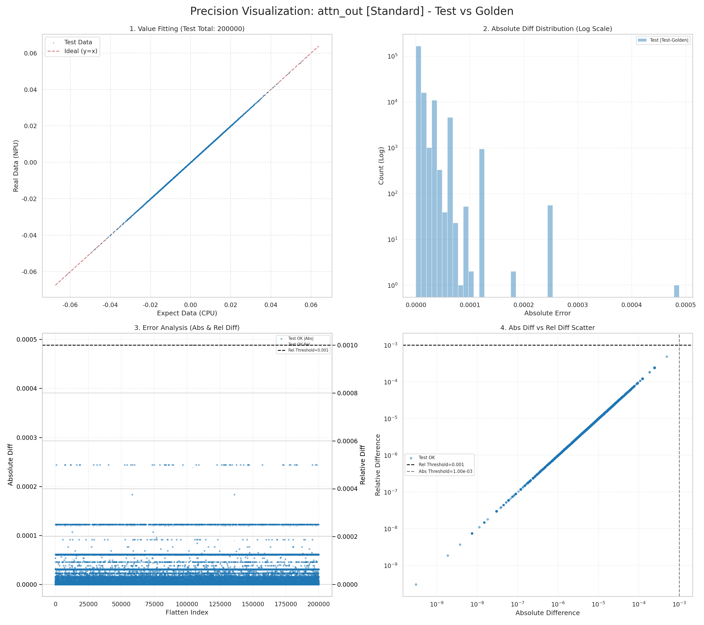
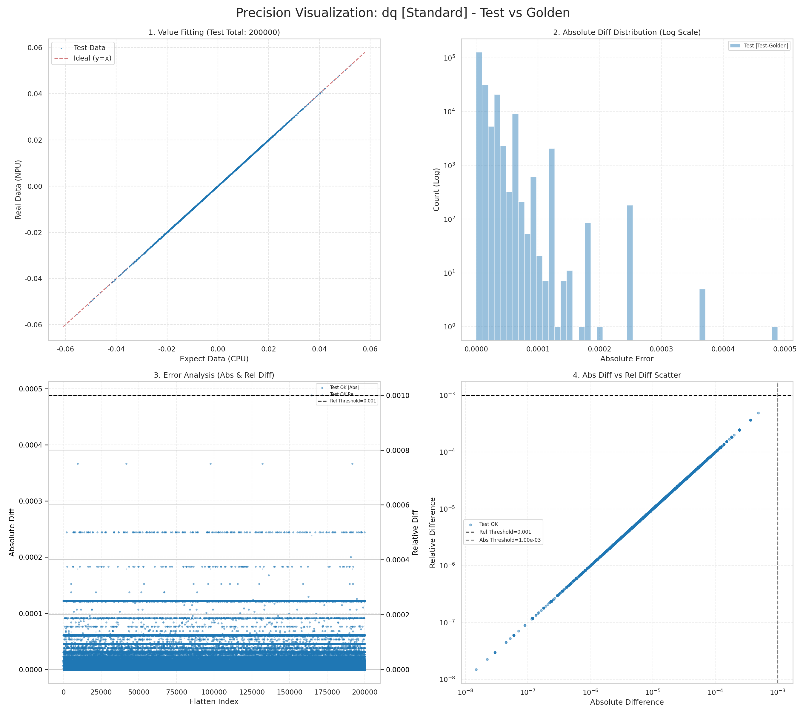
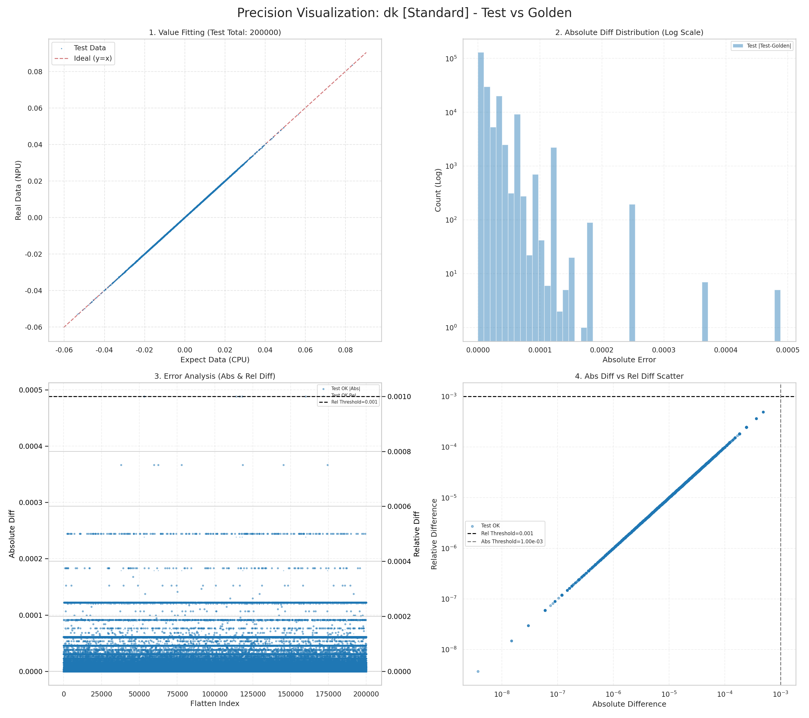
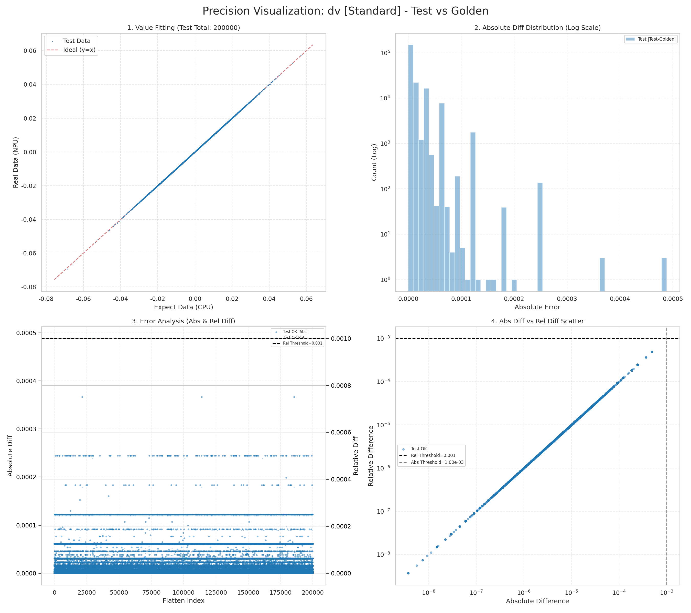
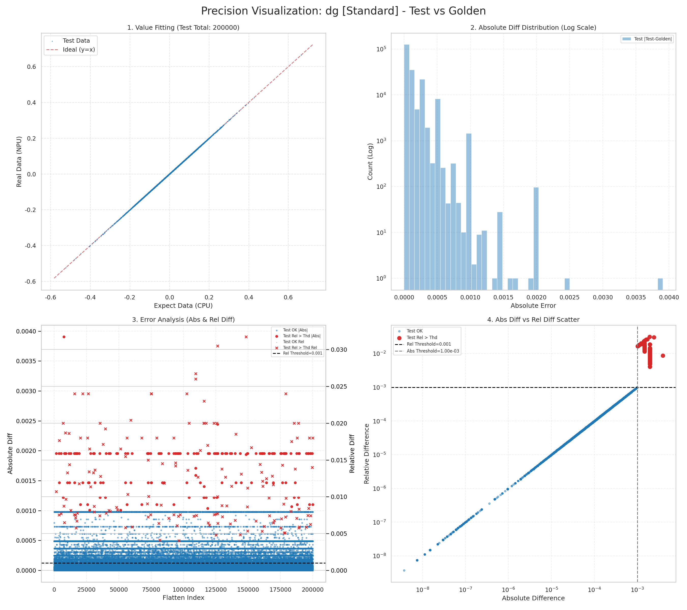
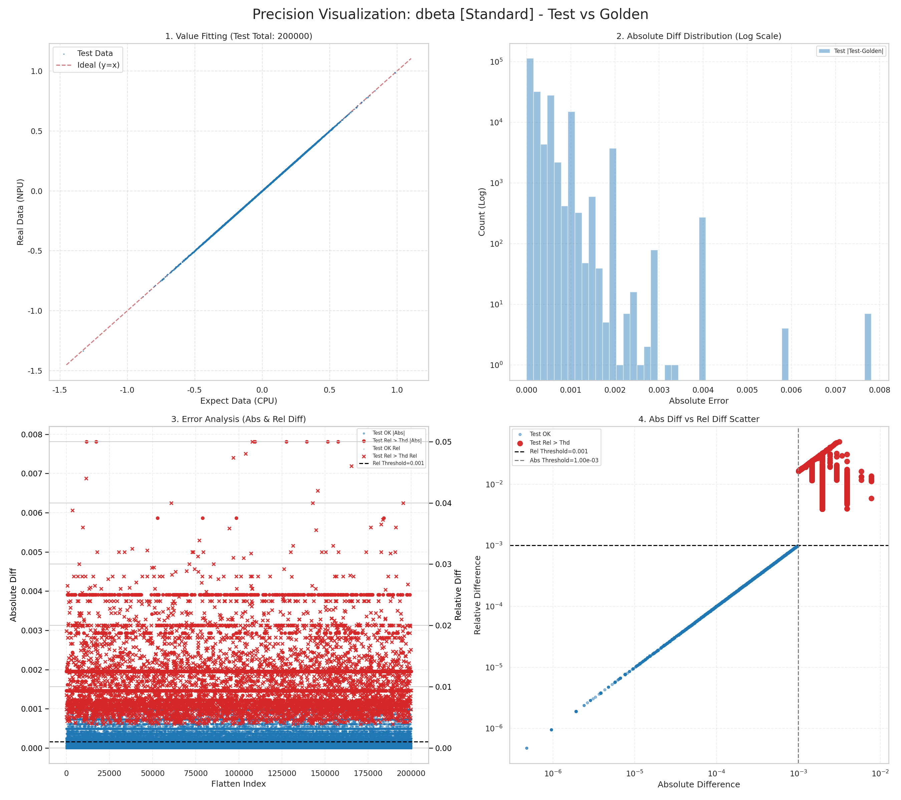

# v26.6.0 A2 GDN 总体验证报告

## 1. 归档信息

| 项目 | 内容 |
| --- | --- |
| 测试日期 | 2026-07-29 |
| 软件版本 | v26.6.0 |
| 实现仓 PR | [flashserve/flash-linear-attention-npu#249](https://github.com/flashserve/flash-linear-attention-npu/pull/249) |
| 被测提交 | [`9aa9b324`](https://github.com/weinachuan/flash-linear-attention-npu/commit/9aa9b324455efb33419fe682fe26d95f72423082) |
| 主要算子 | AscendC `solve_tri` |
| 端到端范围 | causal-conv 正反向、GDR 正反向、checkpoint recompute、纯异步多层串联 |
| 硬件范围 | A2 |

本报告使用 v26.6.0 最新源码本地构建的 wheel，不使用 release 中的预编译
wheel。报告中的性能结论来自 `msopprof BasicInfo`，不使用 Python wall
time。

## 2. 总结论

AscendC `solve_tri` 的 A2 64×64 FP32 kernel 完成稀疏块合并优化后：

| heads | PR 前 BF16 | FP32 优化前 | FP32 优化后 | FP32 内部优化加速比 |
| ---: | ---: | ---: | ---: | ---: |
| 8 | 1344.26 us | 5581.43 us | 4442.20 us | 1.256x |
| 16 | 2681.40 us | 11285.32 us | 8871.40 us | 1.272x |

- 优化后的 AscendC 核心比 fla-org Triton-Ascend 对照实现快约 1.205x。
- FP32 稳定性修复仍有明确成本：优化后相对 PR 前 BF16 核心慢约
  3.30x；PR 前 BF16 数据只能作为性能基线，不能作为可用实现。
- 每个参与 AIC 的 FP32 workspace 从 192 KiB 降到 64 KiB，减少 66.7%。
- 所有中间矩阵乘保持原生 FP32，明确关闭 HF32。
- 单算子测试 15/15 通过。
- `T=32768, H=8, BT=64` 完整 GDR 正反向链与 fla-org
  Triton-Ascend 对比，`attn_out/dq/dk/dv/dg/dbeta` 全部 finite；相对
  L2 为 0.00321～0.00503，余弦相似度均大于 0.99998。
- 原问题 `T=32768, H=16, BT=64` 单层正反向通过。
- 100 层 × 20 step 纯异步压力通过，输出、输入梯度、grad norm 和全部
  参数梯度逐 step 二进制一致。
- 四卡 TP/SP/CP、Qwen3.5/Qwen-Next/GVA、BF16/FP16 泛化用例通过。
- TND 上三角与短尾无效区保持为 0。

## 3. 环境与测试口径

| 项目 | 版本或配置 |
| --- | --- |
| Python | 3.10.20 |
| PyTorch | 2.10.0 |
| torch-npu | 2.10.0.post2 |
| triton-ascend | 3.2.1 |
| fla-npu | v26.6.0 源码构建 |
| 主测试 dtype | BF16 |
| 补充 dtype | FP16 |
| chunk size | 64 |
| 原问题 shape | `T=32768, H=16, K=V=128` |
| varlen metadata | 原始 64 段 `cu_seqlens` |

测试未设置 launch blocking、关闭 task queue 或其他强串行环境变量。
100 层压力脚本在层内、层间和 step 提交主体中不调用
`torch.npu.synchronize()`；全部 step 提交后才统一回读 finite 和确定性
结果。

## 4. 优化内容

### 4.1 原实现瓶颈

原 64×64 路径在一个 tile 内执行 10 次完整 `64×64×64` FP32 GEMM：

- 6 次用于四个 16×16 MCH 基块递推；
- 4 次用于 16→32 和 32→64 两级 MXR 合并。

MXR 辅助矩阵的大部分区域为零，但原实现仍执行完整 64×64 GEMM。

### 4.2 最终算法

最终方案保留 A2 上性能更好的连续 MCH GEMM，只优化两级 MXR 合并：

1. 16→32：将两组独立块打包，每阶段执行一次
   `32×16 @ 16×32` FP32 GEMM。
2. 32→64：每阶段只执行一次 `32×32 @ 32×32` FP32 GEMM。
3. AIV 只把有效下三角合并块写回运行中的逆矩阵。
4. workspace 使用四个连续 64×64 FP32 槽，分别保存运行逆矩阵、幂矩阵、
   GEMM 临时结果和 `-A`。

两级合并的 GEMM MAC 数从 `4 × 64³` 降为
`2 × (32×32×16) + 2 × 32³`，减少 90.625%；整个 64×64 solve 的
GEMM MAC 数减少 36.25%。

AIC/AIV ready/free 双向握手和 tile workspace 复用边界保持不变，没有
引入额外 host 同步或 device-to-host 回读。

### 4.3 未采用方案

以下方案在 A2、`T=32768, H=8, BT=64` 上性能更差，因此未采用：

| 方案 | SolveTri |
| --- | ---: |
| 仅 workspace stride 128→64 | 5513.63 us |
| MCH 拆为四次 16×16 GEMM | 6448.24 us |
| GM 拼块后执行 MCH | 7484.97 us |
| L1 直接拼块后执行 MCH | 6317.57 us |

结果表明 A2 上多个小 GEMM 的调用、拼块和搬运开销会抵消计算量收益；
稀疏优化应集中在两级 MXR 合并。

## 5. 适配层调用

GDR 适配脚本通过稳定入口调用：

```python
from fla_npu.ops.ascendc import npu_solve_tri
```

实际调用语义：

- KKT 输出 FP32 `A`；
- 适配层按模型 dtype 将 `A` 转为 BF16/FP16，因此进入 `solve_tri` 接口
  的 `A` 与 `k` 同 dtype，并不是 FP32；
- AscendC kernel 读入后将 `A` 提升为 FP32，MCH 和 MXR 的所有中间矩阵
  及 GEMM 均保持原生 FP32；
- 最终结果转换回输入 dtype；
- packed varlen 使用 TND；
- dense 输入保留 `[B,S,N,D]` 并使用 BSND。

`causal_conv1d` 和 `causal_conv1d_bwd` 由独立 autograd wrapper 调用，
正向启用 NTD 输出。层内和层间没有额外 device-to-host 同步。

## 6. 单算子与精度验证

### 6.1 单算子

`solve_tri` 共 15 个单算子用例，15/15 通过，覆盖：

- chunk size 16、32、64、128；
- FP16/BF16；
- MCH 大数值中间结果；
- BSND/BHTD/TND；
- 非 16 对齐尾块；
- TND 上三角和短尾无效区清零。

### 6.2 真实 KKT 输入

输入由 BF16 `k/g/beta` 经真实 `chunk_local_cumsum` 和
`chunk_scaled_dot_kkt_fwd(output_dtype=torch.float32)` 生成。AscendC
输出与 fla-org Triton-Ascend 参考结果对比如下：

| shape | 两端 finite | 最大绝对误差 | 相对 L2 |
| --- | --- | ---: | ---: |
| `T=32768, H=8, BT=64` | 是 | 0.0009765625 | 4.6058543e-5 |
| `T=32768, H=16, BT=64` | 是 | 0.0009765625 | 4.6225377e-5 |

### 6.3 完整 GDR 正反向链与 fla-org 对比

本项不是只比较 `solve_tri` 单算子，而是覆盖完整 GDR 正反向算子链：

- 正向：L2Norm、local cumsum、KKT、SolveTri、recompute W/U、forward
  state、forward output；
- 反向：local dV、dH/dU、dQ/dK/dW/dG、WY backward、reverse cumsum、
  L2Norm backward；
- 被测组：PR #249 的 fla_npu 实现；
- Golden：fla-org 仓 `triton_ascend` backend 的对应实现；
- gate 在适配边界保持数学等价：fla_npu 使用自然对数域，fla-org 的
  `exp2` 实现接收 `g_nat / ln(2)`，没有混用两个 gate 域。

固定输入口径为 BF16、seed 42、`T=32768, H=8, K=V=128, BT=64`、
原始 64 段 `cu_seqlens`、packed varlen NTD、启用 Q/K L2Norm、无
`initial_state`。两端使用完全相同的 q/k/v/g/beta 和 NTD 上游梯度。
下表统计全部元素；相对 L2 定义为
`||fla_npu - fla_org||₂ / ||fla_org||₂`。

| tensor | 元素数 | 两端 non-finite | 最大绝对误差 | 平均绝对误差 | 相对 L2 | 余弦相似度 |
| --- | ---: | ---: | ---: | ---: | ---: | ---: |
| attn_out | 33,554,432 | 0 | 0.00048828125 | 5.9768981e-6 | 0.0032067452 | 0.9999948585 |
| dq | 33,554,432 | 0 | 0.0009765625 | 1.2759763e-5 | 0.0049174248 | 0.9999879188 |
| dk | 33,554,432 | 0 | 0.0009765625 | 1.2752296e-5 | 0.0050252015 | 0.9999873830 |
| dv | 33,554,432 | 0 | 0.0009765625 | 9.3466962e-6 | 0.0042865468 | 0.9999908130 |
| dg | 262,144 | 0 | 0.00390625 | 9.9277640e-5 | 0.0049644026 | 0.9999876787 |
| dbeta | 262,144 | 0 | 0.0078125 | 2.6508618e-4 | 0.0046235450 | 0.9999893115 |

机器可读的全量统计归档在
[`fullchain_accuracy_metrics.json`](assets/gdn_a2_total_validation/fullchain_accuracy_metrics.json)。

以下图由 `ct viz` 直接读取两端的完整 NPY 后生成。图中
Test/Real/NPU 表示 fla_npu，Golden/Expect/CPU 表示 fla-org；每张图
均匀抽样 200,000 点用于显示，采样不影响上表的全量统计。

#### 正向 attn_out



#### 反向 dq



#### 反向 dk



#### 反向 dv



#### 反向 dg



#### 反向 dbeta



## 7. 性能验证

只统计 SolveTri 核心，不包含 KKT、FP32→BF16 cast 和适配层无效区清零。
PR 前 BF16 基线从 v26.6.0 基线提交重新本地构建，不使用 release wheel。
H=8/H=16 分别取 20/12 次稳态结果；其余实现由 `msopprof BasicInfo`
统计 Task Duration。

| shape | PR 前 BF16 AscendC | fla-org Triton-Ascend | FP32 优化前 AscendC | FP32 优化后 AscendC |
| --- | ---: | ---: | ---: | ---: |
| `T=32768, H=8, BT=64` | 1344.26 us | 5350.82 us | 5581.43 us | 4442.20 us |
| `T=32768, H=16, BT=64` | 2681.40 us | 10692.24 us | 11285.32 us | 8871.40 us |

相对 fla-org，优化后 H=8/H=16 时延分别降低 16.98%/17.03%。
相对 PR 前 BF16，优化后的 FP32 路径分别慢 3.305x/3.308x；这是消除
MCH/MXR 中间 BF16 舍入后当前实测到的稳定性成本。

## 8. BF16 SolveTri 误差放大链与可用数值范围

本节的旧 BF16 路径按 PR 前源码逐级复现：每次 Cube GEMM 保持 FP32
累加，但每个 MCH/MXR 基块结果按旧实现落回 BF16，再作为下一阶段输入。
同一复现框架切换到 FP32 中间结果后，在完整 `T=32768, H=8` 用例上与
修复后的真实 kernel 二进制一致（最大绝对误差为 0），因此下表隔离的是
中间 dtype 变化，而不是换算法或换输入带来的差异。

### 8.1 根因不是 BF16 指数范围不足

BF16 和 FP32 都使用 8 位指数，最大有限值接近：

| dtype | 有效二进制位 | unit roundoff | 最大有限值 | 最小正规数 |
| --- | ---: | ---: | ---: | ---: |
| BF16 | 8 | `2^-8 = 3.90625e-3` | 3.3895314e38 | 1.1754944e-38 |
| FP32 | 24 | `2^-24 = 5.9604645e-8` | 3.4028235e38 | 1.1754944e-38 |

因此问题不是 BF16 在数值 100～1000 时直接超过表示上限，而是它只有
7 位显式尾数。数值约为 147 时 BF16 相邻可表示数间隔已经是 1，约为
564 时相邻间隔是 4；此时 MCH/MXR 中本应保留下来参与抵消的小量会在
每次矩阵乘结果落回 BF16 时丢失。

### 8.2 误差如何在 MCH/MXR 内产生

对严格下三角矩阵 `A`，16×16 MCH 的计算可写为：

```text
(I - A)(I + A²)(I + A⁴)(I + A⁸) = (I + A)⁻¹
```

中间的 `A²/A⁴/A⁸` 包含大量路径乘积与求和；单项可达到数百，但最终
逆矩阵的有效元素可能仍在 1 附近，所以这是典型的大数相消。旧实现虽由
Cube 做 FP32 累加，却在每个 MCH/MXR 基块结果后转回 BF16，再把该结果
送进下一次 GEMM。BF16 舍入误差因此不是只发生一次，而是被下一次平方、
乘法和块合并继续放大。

在原始 `T=32768, H=8, BT=64` varlen 用例中，对最后一段、head 6
构造重复归一化 key、累计 gate 为 0、`beta=0.796875` 的有效 KKT
输入，单个 64×64 tile 的中间结果如下：

| 阶段 | 旧 BF16 中间结果 abs max | FP32 中间结果 abs max | 最大绝对误差 | 相对 L2 |
| --- | ---: | ---: | ---: | ---: |
| 输入 A | 0.796875 | 0.796875 | 0 | 0 |
| A² | 8.875 | 8.8901367 | 0.0151367 | 0.0015688 |
| MCH 第 1 轮 | 38 | 37.954868 | 0.0506973 | 0.0016060 |
| A⁴ | 147 | 146.778412 | 0.2877731 | 0.0023402 |
| MCH 第 2 轮 | 316 | 312.950928 | 3.0490723 | 0.0082108 |
| A⁸ | 564 | 558.044556 | 5.9554443 | 0.0115813 |
| MCH 第 3 轮 | 1.21875 | 1 | 1.2187653 | 0.4546736 |
| 16→32 MXR | 5.3125 | 1 | 5.3125 | 1.7245898 |
| 32→64 MXR / 最终 | 192 | 1 | 192 | 43.484668 |

`A⁸` 的 BF16/FP32 差异看起来仍只有约 1.16% 相对 L2，但后续相消要求
保留远高于 BF16 的有效精度；经过最后两级 MXR 后，误差已从小的舍入
偏差变成数量级错误。

### 8.3 为什么先看到 w 离群，再在 fwd_h 中溢出

设 `L=SolveTri(A)`。后续计算可概括为：

```text
Wc = Lc · (Kc · beta · exp(g))
Uc = Lc · (Vc · beta)
v'c = Uc - Wc · Sc
Sc+1 = Dc · Sc + Kcᵀ · Dc · v'c
```

代入 `v'c` 后，状态转移包含：

```text
Sc+1 = (Dc - Kcᵀ · Dc · Wc) · Sc + Kcᵀ · Dc · Uc
```

所以 `L` 的误差先直接进入 `W/U`；`W` 的误差又改变每个 chunk 的状态
转移矩阵。如果扰动使有效谱半径跨过 1，误差会按 chunk 几何放大。原问题
最后一个 segment 有 168 个 chunk，因此不需要某一次乘法立即超过
3.39e38，也能在多次递推后产生溢出。

在上述 `beta=0.796875` 构造中：

| 张量 | 旧 BF16 中间路径 | FP32 中间路径 |
| --- | ---: | ---: |
| SolveTri abs max | 192 | 1 |
| w abs max | 444 | 0.796875 |
| u abs max | 103.5 | 0.494140625 |
| h non-finite | 2,531,872 | 0 |
| attn_out non-finite | 1,270,912 | 0 |

旧路径的 `h` 在 segment 内第 1/2/3/4 个递推 chunk 的 abs max 约为
`206 / 2.66e5 / 3.44e8 / 4.45e11`，第 8 个 chunk 达到
`1.24e24`，第 11 个 chunk 达到 `2.66e33`，第 13 个 chunk 首次
出现 non-finite。由此可见，现场观察到的 `w` 正负离群点是 SolveTri
舍入失稳已经外显的症状；真正把它推到 NaN 的是 fwd_h 长序列状态递推。

### 8.4 实测数值边界

对于当前 GDN 语义，Q/K 归一化、`beta∈[0,1]`、累计 gate 单调不增时，
KKT 的有效严格下三角元素满足 `|Aij|≤1`。这个语义范围不同于“任意
元素都在 [-1,1] 的下三角矩阵”；后者仍可能有完全不同的条件数和路径
相消结构。

同一重复 key 构造的实测结果如下：

| BF16 实际 alpha | 旧 BF16 中间路径 | FP32 中间路径 |
| ---: | --- | --- |
| 0.75 | 全部 finite，但 attn_out 相对 L2 已达 0.196 | finite，h abs max 0.3223 |
| 0.79296875 | h abs max 1.1183e25，尚未 NaN | finite，h abs max 约 0.332 |
| 0.796875 | h/attn_out 出现 non-finite | finite，h abs max 0.3359 |
| 1.0 | SolveTri/w abs max 达 1024/2048，h 出现 non-finite | SolveTri abs max 1，完整链 finite |

因此：

- 旧 BF16 中间路径不存在只按 `max(|A|)` 就能给出的可靠安全阈值；
  `0.75` 虽未溢出，精度已经不可接受，不能称为可用范围。
- 当前 FP32 中间路径已在真实随机 KKT 输入以及上述结构化压力输入上覆盖
  到 GDN 语义边界 `|Aij|=1`，最终输出再转回模型 dtype；该结论是本轮
  `BT=64` 实测范围，不外推为任意下三角矩阵的数学保证。
- FP32 修复消除了每轮 MCH/MXR 的 BF16 舍入，仅保留适配层把 KKT 的
  FP32 `A` 转成模型 dtype 时的一次输入量化，以及最终结果转回模型
  dtype 时的一次输出量化。
- kernel 全程使用原生 FP32 GEMM，不启用 HF32。只有当 FP32 中间值本身
  接近 3.40e38，或输入超出上述 GDN 语义/条件数范围时，才需要另行评估
  FP32 溢出风险。

## 9. 原问题与压力验证

### 9.1 单层原问题

| 项目 | 结果 |
| --- | --- |
| 配置 | 1 层、2 step、BF16、关闭 checkpoint |
| shape | `T=32768, H=16, K=V=128, BT=64` |
| forward/backward | finite |
| grad norm | 两个 step 均为 `4.1270857` |
| 二进制确定性 | output、input grad、grad norm、全部参数梯度一致 |
| 峰值显存 | 4429.14 MiB |

### 9.2 100 层 × 20 step

| 项目 | 结果 |
| --- | --- |
| activation checkpoint | 启用 |
| causal-conv 正反向 | 启用，正向 NTD 输出 |
| GDR 正反向 | 启用 |
| step 主体冗余同步 | 无 |
| finite | 20/20 step 通过 |
| grad norm | 20 个 step 均为 `40.915497` |
| 二进制确定性 | output、input grad、grad norm、全部参数梯度逐 step 一致 |
| 峰值显存 | 21.219 GiB |
| 总结果 | PASS |

## 10. 四卡泛化验证

每个 case 对相同输入运行两次。确定性使用 `torch.equal` 比较输出和全部
训练梯度。shape 为单 rank 的
`T / key_heads / value_heads / key_dim / value_dim`。

| 场景 | 单 rank shape | dtype | finite | 确定性 | 峰值显存 |
| --- | --- | --- | --- | --- | ---: |
| Qwen3.5-4B TP4 训练 | 32768 / 4 / 8 / 128 / 128 | BF16 | 通过 | 通过 | 1694.09 MiB |
| Qwen3.5-4B SP4 训练 | 8192 / 16 / 32 / 128 / 128 | BF16 | 通过 | 通过 | 1692.53 MiB |
| Qwen3.5-35B-A3B TP4 训练 | 32768 / 4 / 8 / 128 / 128 | BF16 | 通过 | 通过 | 1694.09 MiB |
| Qwen3.5-35B-A3B CP4 训练 | 8192 / 16 / 32 / 128 / 128 | BF16 | 通过 | 通过 | 1692.55 MiB |
| Qwen3-Next TP4 prefill | 32768 / 4 / 8 / 128 / 128 | BF16 | 通过 | 通过 | 971.07 MiB |
| Qwen3-Next CP4 prefill | 8192 / 16 / 32 / 128 / 128 | BF16 | 通过 | 通过 | 969.53 MiB |
| GVA V=256 TP4 训练 | 16384 / 4 / 8 / 128 / 256 | BF16 | 通过 | 通过 | 1334.06 MiB |
| Qwen3.5-4B TP4 训练 | 32768 / 4 / 8 / 128 / 128 | FP16 | 通过 | 通过 | 1694.09 MiB |

本轮按模型不使用 `initial_state` 的前提执行。模型权重、optimizer state、
MoE 和 dense attention 不在适配层显存统计内。

## 11. 执行命令

### 11.1 源码构建

```bash
FLA_NPU_SOC=ascend910b \
python -m pip wheel --no-build-isolation --no-deps . -w dist

python -m pip install --force-reinstall --no-deps \
  dist/flash_linear_attention_npu-*.whl
```

### 11.2 单算子

```bash
python fla/ops/ascendc/gdn/recurrent_gdn/solve_tri/test/test.py
```

### 11.3 单层与 100 层压力

```bash
python examples/flash_gated_delta_rule_100layer_adapter_stress.py \
  --layers 1 --steps 2 --no-checkpoint --replay-step-inputs --md5

python examples/flash_gated_delta_rule_100layer_adapter_stress.py \
  --layers 100 --steps 20 --replay-step-inputs
```

### 11.4 四卡模型用例

```bash
python -m torch.distributed.run --nproc_per_node 4 \
  examples/chunk_gated_delta_rule_model_matrix.py \
  --case qwen35_35b_tp4_train \
  --determinism-runs 2
```

### 11.5 SolveTri 精度对照

```bash
export FLA_ORG_ROOT=/path/to/flash-linear-attention

python examples/solve_tri_backend_benchmark.py \
  --backend compare \
  --tokens 32768 \
  --heads 8 \
  --chunk-size 64 \
  --dtype bf16 \
  --a-dtype fp32 \
  --input-source kkt \
  --repeats 1
```

### 11.6 完整 GDR 正反向与 ct viz

两端分别用相同 seed 生成输入，调用
`StressGatedDeltaRuleFunction.apply` 和
`BackendAblationGatedDeltaRuleFunction.apply`，保存
`attn_out/dq/dk/dv/dg/dbeta` 为 FP32 NPY。fla-org 侧选择全部
`triton_ascend` stage，并在适配边界完成 `g_nat / ln(2)` 转换。

```bash
ct viz fla_npu/attn_out.npy fla_org/attn_out.npy \
  --out_dir ct_viz/attn_out \
  --name attn_out \
  --spatial \
  -sc 200000
```

其余五个张量按相同命令替换文件名。`ct viz` 默认高亮阈值为 0.001；
全量相对 L2、最大/平均绝对误差和余弦相似度另由完整 NPY 逐元素统计。
